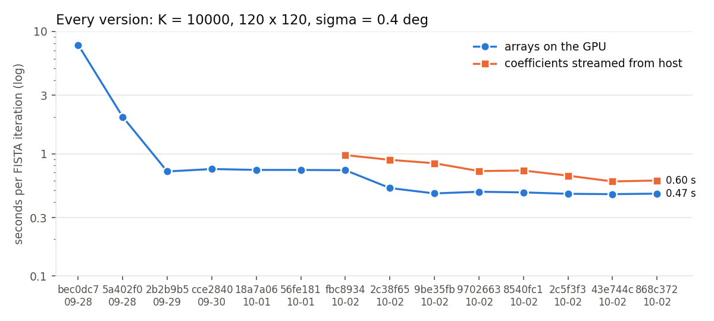
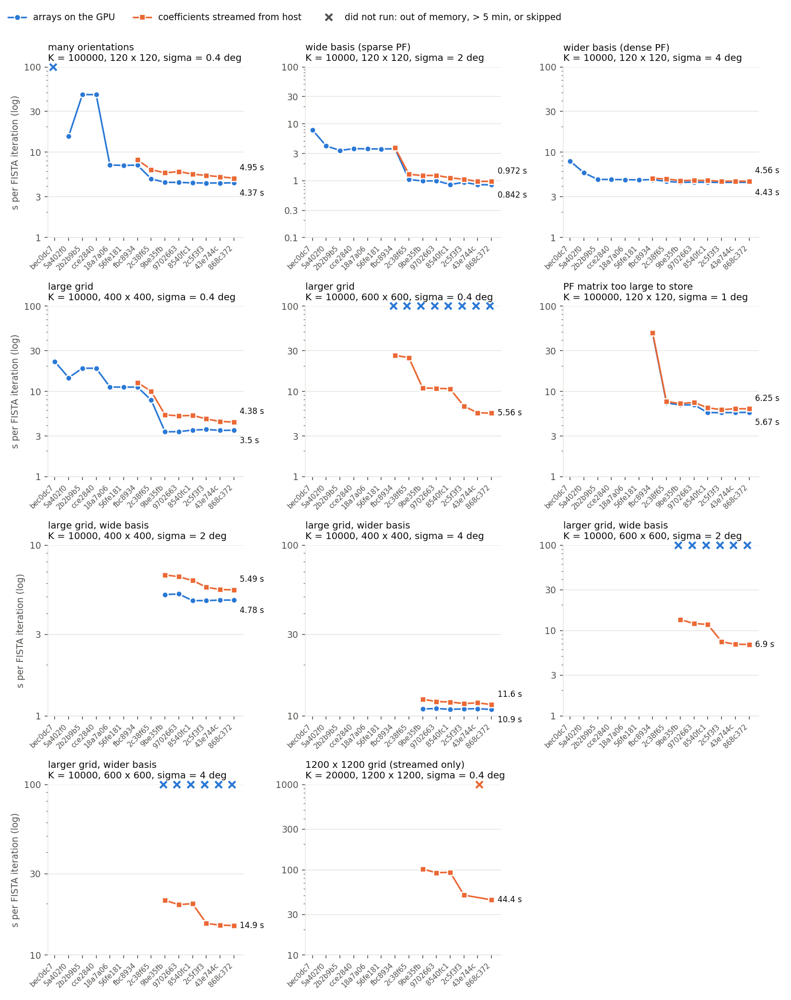
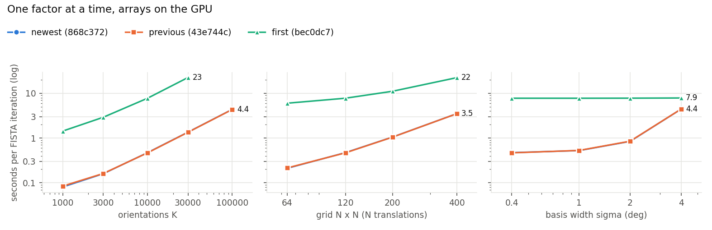
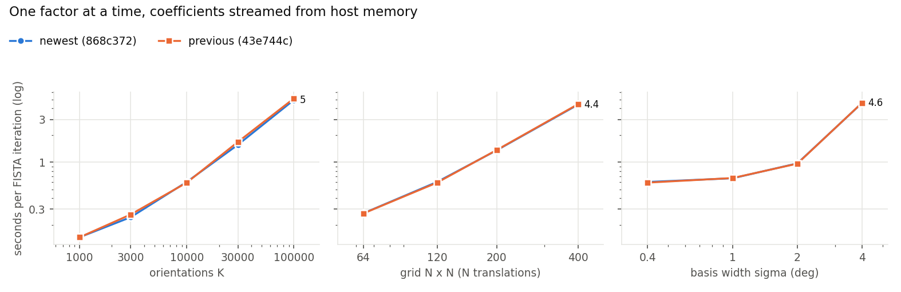
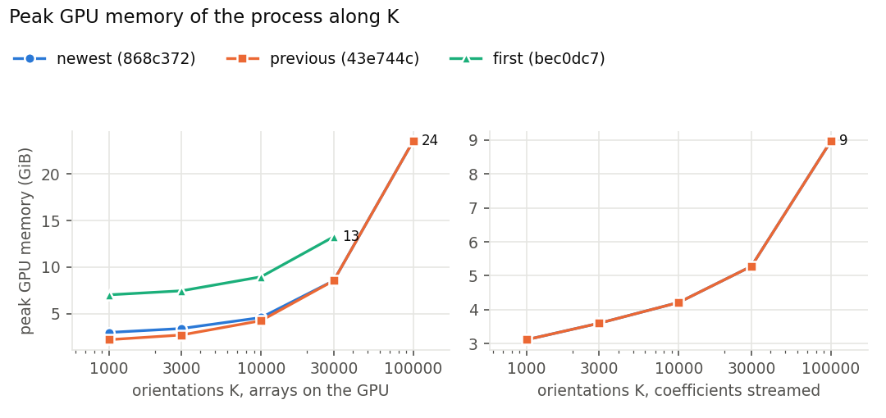

# Benchmarks

Speed and peak memory of diffractom's texture-tomography reconstruction across versions, on one machine: NVIDIA A40 (48 GB), Intel(R) Xeon(R) Gold 6326 CPU @ 2.90GHz, host `n-62-18-4`. Generated by `benchmarks/report.py` from `benchmarks/results/*.jsonl`; how to run them: [benchmarks/run.py](run.py), [benchmarks/submit.sh](submit.sh).

**The problem.** Synthetic, so only the sizes matter: K random orientations (Gaussian basis functions of width sigma), an N x N grid scanned with N translations, 360 rotation angles (0-180 deg), 360 azimuthal bins, 14 aluminium rings. Around the base case K = 10000, 120 x 120, sigma = 0.4 deg, one factor is varied at a time.

**Measured**, each case in a fresh process: building the operator (including the PF matrix), one forward and one adjoint projection, one power iteration, and FISTA-Huber (non-negative); the tables show the time per FISTA iteration. Two modes: *GPU* (coefficients and data are pyopencl arrays on the GPU) and *streamed* (NumPy arrays; the coefficients stay in host memory and pass through the GPU batch by batch). Peak memory is that of the process (GPU: nvidia-smi, includes the ~0.4 GB CUDA context; host: RSS). A case over 5 minutes is stopped, and the rest of its sweep skipped.

## Versions

| version | date | what changed |
|---|---|---|
| `868c372` | 2026-10-02 | FISTA (GPU arrays and streamed): next forward pass inside the adjoint pass; fused residual/norm/clip; PF forward skips empty rows (iterates unchanged) |
| `43e744c` | 2026-10-02 | streamed FISTA: next forward pass inside the adjoint pass; fused residual/norm/clip; PF forward skips empty rows (iterates unchanged) |
| `2c5f3f3` | 2026-10-02 | Fourier-slice projector (projector="fft"), the default above 400 x 400 pixels (results differ by ~1 %) |
| `8540fc1` | 2026-10-02 | defaults: PF Gaussians cut at 3 sigma (was 3.46; results change by ~1 %), parallel random start of the streamed power iteration |
| `9702663` | 2026-10-02 | streamed power iteration on all cores, streaming buffers kept with the operator; sparse up to 30 % fill when stored (results unchanged) |
| `9be35fb` | 2026-10-02 | tiled Radon projections (image rows / sinogram bins staged in local memory); at least 4 batches in the sparse modes |
| `2c38f65` | 2026-10-02 | sparse PF matrix generated directly, faster sparse products, store what fits, Radon in slices, larger batches |
| `fbc8934` | 2026-10-02 | NumPy API, (K, Ny, Nx) layout |
| `56fe181` | 2026-10-01 | FISTA coefficients streamed from host memory |
| `18a7a06` | 2026-10-01 | fused FISTA update: 2 coefficient arrays instead of 4 |
| `cce2840` | 2026-09-30 | 64-bit indexing in the FISTA, prox and PF kernels |
| `2b2b9b5` | 2026-09-29 | field-of-view support constraint in FISTA |
| `5a402f0` | 2026-09-28 | sparse PF matrix (`pf_mode="auto"`) |
| `bec0dc7` | 2026-09-28 | before the speed-ups: dense PF matrix only |

## Newest (`868c372`) against the version before it (`43e744c`)

Seconds per FISTA iteration, steady state (without the first iteration, which includes the setup) where both versions recorded it (marked s), else the average of the two iterations; speed-up = previous / newest (below 1: slower). Single short runs: differences within about 10 % are noise.

| case | mode | previous | newest | speed-up |
|---|---|---:|---:|---:|
| K = 1000, 120 x 120, sigma = 0.4 | gpu | 0.0685 | 0.0504 | 1.36x s |
| K = 3000, 120 x 120, sigma = 0.4 | gpu | 0.143 | 0.105 | 1.37x s |
| K = 10000, 64 x 64, sigma = 0.4 | gpu | 0.192 | 0.139 | 1.38x s |
| K = 10000, 120 x 120, sigma = 0.4 | gpu | 0.443 | 0.326 | 1.36x s |
| K = 10000, 120 x 120, sigma = 1 | gpu | 0.506 | 0.375 | 1.35x s |
| K = 10000, 120 x 120, sigma = 2 | gpu | 0.829 | 0.6 | 1.38x s |
| K = 10000, 120 x 120, sigma = 4 | gpu | 4.44 | 3.32 | 1.34x s |
| K = 10000, 200 x 200, sigma = 0.4 | gpu | 1.03 | 0.755 | 1.36x s |
| K = 10000, 400 x 400, sigma = 0.4 | gpu | 3.47 | 2.45 | 1.42x s |
| K = 10000, 400 x 400, sigma = 2 | gpu | 4.77 | 3.45 | 1.38x s |
| K = 10000, 400 x 400, sigma = 4 | gpu | 11.1 | 8.13 | 1.36x s |
| K = 10000, 600 x 600, sigma = 0.4 | gpu | *array > largest GPU buffer* | *array > largest GPU buffer* |  |
| K = 10000, 600 x 600, sigma = 2 | gpu | *array > largest GPU buffer* | *array > largest GPU buffer* |  |
| K = 10000, 600 x 600, sigma = 4 | gpu | *skipped* | *skipped* |  |
| K = 30000, 120 x 120, sigma = 0.4 | gpu | 1.31 | 0.961 | 1.36x s |
| K = 100000, 120 x 120, sigma = 0.4 | gpu | 4.3 | 3.14 | 1.37x s |
| K = 100000, 120 x 120, sigma = 1 | gpu | 5.6 | 4.03 | 1.39x s |
| K = 1000, 120 x 120, sigma = 0.4 | stream | 0.0583 | 0.0579 | 1.01x s |
| K = 3000, 120 x 120, sigma = 0.4 | stream | 0.115 | 0.114 | 1.00x s |
| K = 10000, 64 x 64, sigma = 0.4 | stream | 0.144 | 0.145 | 1.00x s |
| K = 10000, 120 x 120, sigma = 0.4 | stream | 0.337 | 0.337 | 1.00x s |
| K = 10000, 120 x 120, sigma = 1 | stream | 0.386 | 0.385 | 1.00x s |
| K = 10000, 120 x 120, sigma = 2 | stream | 0.608 | 0.61 | 1.00x s |
| K = 10000, 120 x 120, sigma = 4 | stream | 3.36 | 3.34 | 1.01x s |
| K = 10000, 200 x 200, sigma = 0.4 | stream | 0.779 | 0.779 | 1.00x s |
| K = 10000, 400 x 400, sigma = 0.4 | stream | 2.49 | 2.49 | 1.00x s |
| K = 10000, 400 x 400, sigma = 2 | stream | 3.4 | 3.39 | 1.00x s |
| K = 10000, 400 x 400, sigma = 4 | stream | 8.28 | 8.24 | 1.01x s |
| K = 10000, 600 x 600, sigma = 0.4 | stream | 3.49 | 3.42 | 1.02x s |
| K = 10000, 600 x 600, sigma = 2 | stream | 4.45 | 4.44 | 1.00x s |
| K = 10000, 600 x 600, sigma = 4 | stream | 10.6 | 10.5 | 1.01x s |
| K = 20000, 1200 x 1200, sigma = 0.4 | stream | *out of memory* | 44.4 |  |
| K = 30000, 120 x 120, sigma = 0.4 | stream | 0.977 | 0.974 | 1.00x s |
| K = 100000, 120 x 120, sigma = 0.4 | stream | 3.18 | 3.18 | 1.00x s |
| K = 100000, 120 x 120, sigma = 1 | stream | 3.9 | 3.89 | 1.00x s |

## Every version on the base case

<picture>
  <source media="(prefers-color-scheme: dark)" srcset="figures/versions_dark.png">
  
</picture>

## Every version on other cases

The larger cases (600 x 600; K = 100000 at sigma = 1 deg) are in the suite `large`, run only for the newest versions.

<picture>
  <source media="(prefers-color-scheme: dark)" srcset="figures/versions_cases_dark.png">
  
</picture>

### GPU or streamed?

With the arrays on the GPU, FISTA keeps about three coefficient arrays (4 K N^2 bytes each) and two data arrays on the device; streamed, the coefficients stay in host memory and only batch-sized buffers are on the GPU. When everything fits, the GPU mode is faster (the streamed mode adds the transfers, partly overlapped with the computation). It stops fitting at two limits:

- the largest single GPU buffer, about a quarter of the device memory (about 12 GB on a 48 GB A40): a coefficient array of more than 3 * 10^9 values, e.g. K = 10000 orientations on a 600 x 600 grid (14.4 GB), cannot be allocated at all;
- the device memory: three coefficient arrays, the data, the sparse PF matrix and the batch buffers. The sparse PF matrix gets what the solver leaves, so a large problem in GPU mode may have to generate its PF matrix in every call (K = 100000 at sigma = 1 deg: generated in the GPU mode, stored when streamed).

So for large grids or many orientations, streaming is not a fallback but the only option; its limit is host memory (the coefficients, twice).

The time per iteration above includes a one-time setup in the first of the two FISTA iterations (streamed: allocating the pinned transfer buffers and copying the start into the second array), which a long reconstruction does not see. Where recorded (from `81d313a`), the steady state:

| version | case | mode | first iteration (s) | steady iteration (s) |
|---|---|---|---:|---:|
| `9be35fb` | K = 20000, 1200 x 1200, sigma = 0.4 | stream | 119.4 | 81.8 |
| `9702663` | K = 10000, 64 x 64, sigma = 0.4 | gpu | 0.199 | 0.196 |
| `9702663` | K = 10000, 64 x 64, sigma = 0.4 | stream | 0.435 | 0.203 |
| `9702663` | K = 1000, 120 x 120, sigma = 0.4 | gpu | 0.0769 | 0.0739 |
| `9702663` | K = 1000, 120 x 120, sigma = 0.4 | stream | 0.315 | 0.0851 |
| `9702663` | K = 3000, 120 x 120, sigma = 0.4 | gpu | 0.152 | 0.149 |
| `9702663` | K = 3000, 120 x 120, sigma = 0.4 | stream | 0.427 | 0.161 |
| `9702663` | K = 10000, 120 x 120, sigma = 0.4 | gpu | 0.456 | 0.452 |
| `9702663` | K = 10000, 120 x 120, sigma = 0.4 | stream | 0.907 | 0.465 |
| `9702663` | K = 10000, 120 x 120, sigma = 1 | gpu | 0.542 | 0.538 |
| `9702663` | K = 10000, 120 x 120, sigma = 1 | stream | 1.03 | 0.553 |
| `9702663` | K = 10000, 120 x 120, sigma = 2 | gpu | 0.966 | 0.969 |
| `9702663` | K = 10000, 120 x 120, sigma = 2 | stream | 1.41 | 0.975 |
| `9702663` | K = 10000, 120 x 120, sigma = 4 | gpu | 4.4 | 4.44 |
| `9702663` | K = 10000, 120 x 120, sigma = 4 | stream | 4.84 | 4.44 |
| `9702663` | K = 30000, 120 x 120, sigma = 0.4 | gpu | 1.34 | 1.56 |
| `9702663` | K = 30000, 120 x 120, sigma = 0.4 | stream | 2.46 | 1.37 |
| `9702663` | K = 100000, 120 x 120, sigma = 0.4 | gpu | 4.37 | 4.34 |
| `9702663` | K = 100000, 120 x 120, sigma = 0.4 | stream | 6.87 | 4.57 |
| `9702663` | K = 100000, 120 x 120, sigma = 1 | gpu | 6.89 | 6.87 |
| `9702663` | K = 100000, 120 x 120, sigma = 1 | stream | 8.7 | 5.9 |
| `9702663` | K = 10000, 200 x 200, sigma = 0.4 | gpu | 1.05 | 1.05 |
| `9702663` | K = 10000, 200 x 200, sigma = 0.4 | stream | 2.45 | 1.08 |
| `9702663` | K = 10000, 400 x 400, sigma = 0.4 | gpu | 3.34 | 3.35 |
| `9702663` | K = 10000, 400 x 400, sigma = 0.4 | stream | 6.66 | 3.57 |
| `9702663` | K = 10000, 400 x 400, sigma = 2 | gpu | 5.12 | 5.18 |
| `9702663` | K = 10000, 400 x 400, sigma = 2 | stream | 8.03 | 4.96 |
| `9702663` | K = 10000, 400 x 400, sigma = 4 | gpu | 10.9 | 11.1 |
| `9702663` | K = 10000, 400 x 400, sigma = 4 | stream | 13.1 | 11.0 |
| `9702663` | K = 10000, 600 x 600, sigma = 0.4 | stream | 13.1 | 8.54 |
| `9702663` | K = 10000, 600 x 600, sigma = 2 | stream | 14.3 | 9.84 |
| `9702663` | K = 10000, 600 x 600, sigma = 4 | stream | 21.9 | 17.6 |
| `9702663` | K = 20000, 1200 x 1200, sigma = 0.4 | stream | 107.6 | 76.9 |
| `8540fc1` | K = 10000, 64 x 64, sigma = 0.4 | gpu | 0.196 | 0.194 |
| `8540fc1` | K = 10000, 64 x 64, sigma = 0.4 | stream | 0.425 | 0.201 |
| `8540fc1` | K = 1000, 120 x 120, sigma = 0.4 | gpu | 0.0755 | 0.0732 |
| `8540fc1` | K = 1000, 120 x 120, sigma = 0.4 | stream | 0.38 | 0.0844 |
| `8540fc1` | K = 3000, 120 x 120, sigma = 0.4 | gpu | 0.151 | 0.149 |
| `8540fc1` | K = 3000, 120 x 120, sigma = 0.4 | stream | 0.393 | 0.16 |
| `8540fc1` | K = 10000, 120 x 120, sigma = 0.4 | gpu | 0.458 | 0.449 |
| `8540fc1` | K = 10000, 120 x 120, sigma = 0.4 | stream | 0.928 | 0.461 |
| `8540fc1` | K = 10000, 120 x 120, sigma = 1 | gpu | 0.514 | 0.69 |
| `8540fc1` | K = 10000, 120 x 120, sigma = 1 | stream | 0.912 | 0.525 |
| `8540fc1` | K = 10000, 120 x 120, sigma = 2 | gpu | 0.825 | 0.824 |
| `8540fc1` | K = 10000, 120 x 120, sigma = 2 | stream | 1.25 | 0.848 |
| `8540fc1` | K = 10000, 120 x 120, sigma = 4 | gpu | 4.38 | 4.42 |
| `8540fc1` | K = 10000, 120 x 120, sigma = 4 | stream | 4.79 | 4.43 |
| `8540fc1` | K = 30000, 120 x 120, sigma = 0.4 | gpu | 1.33 | 1.31 |
| `8540fc1` | K = 30000, 120 x 120, sigma = 0.4 | stream | 2.19 | 1.33 |
| `8540fc1` | K = 100000, 120 x 120, sigma = 0.4 | gpu | 4.33 | 4.29 |
| `8540fc1` | K = 100000, 120 x 120, sigma = 0.4 | stream | 6.43 | 4.43 |
| `8540fc1` | K = 100000, 120 x 120, sigma = 1 | gpu | 5.59 | 5.57 |
| `8540fc1` | K = 100000, 120 x 120, sigma = 1 | stream | 7.14 | 5.47 |
| `8540fc1` | K = 10000, 200 x 200, sigma = 0.4 | gpu | 1.04 | 1.04 |
| `8540fc1` | K = 10000, 200 x 200, sigma = 0.4 | stream | 1.93 | 1.07 |
| `8540fc1` | K = 10000, 400 x 400, sigma = 0.4 | gpu | 3.49 | 3.49 |
| `8540fc1` | K = 10000, 400 x 400, sigma = 0.4 | stream | 6.66 | 3.69 |
| `8540fc1` | K = 10000, 400 x 400, sigma = 2 | gpu | 4.69 | 4.73 |
| `8540fc1` | K = 10000, 400 x 400, sigma = 2 | stream | 7.74 | 4.6 |
| `8540fc1` | K = 10000, 400 x 400, sigma = 4 | gpu | 10.8 | 11.0 |
| `8540fc1` | K = 10000, 400 x 400, sigma = 4 | stream | 13.0 | 11.1 |
| `8540fc1` | K = 10000, 600 x 600, sigma = 0.4 | stream | 13.2 | 8.14 |
| `8540fc1` | K = 10000, 600 x 600, sigma = 2 | stream | 14.0 | 9.51 |
| `8540fc1` | K = 10000, 600 x 600, sigma = 4 | stream | 22.2 | 17.7 |
| `8540fc1` | K = 20000, 1200 x 1200, sigma = 0.4 | stream | 109.2 | 77.6 |
| `2c5f3f3` | K = 10000, 64 x 64, sigma = 0.4 | gpu | 0.196 | 0.194 |
| `2c5f3f3` | K = 10000, 64 x 64, sigma = 0.4 | stream | 0.429 | 0.202 |
| `2c5f3f3` | K = 1000, 120 x 120, sigma = 0.4 | gpu | 0.076 | 0.0732 |
| `2c5f3f3` | K = 1000, 120 x 120, sigma = 0.4 | stream | 0.31 | 0.0812 |
| `2c5f3f3` | K = 3000, 120 x 120, sigma = 0.4 | gpu | 0.15 | 0.147 |
| `2c5f3f3` | K = 3000, 120 x 120, sigma = 0.4 | stream | 0.436 | 0.159 |
| `2c5f3f3` | K = 10000, 120 x 120, sigma = 0.4 | gpu | 0.451 | 0.447 |
| `2c5f3f3` | K = 10000, 120 x 120, sigma = 0.4 | stream | 0.952 | 0.481 |
| `2c5f3f3` | K = 10000, 120 x 120, sigma = 1 | gpu | 0.515 | 0.51 |
| `2c5f3f3` | K = 10000, 120 x 120, sigma = 1 | stream | 0.99 | 0.523 |
| `2c5f3f3` | K = 10000, 120 x 120, sigma = 2 | gpu | 0.825 | 0.955 |
| `2c5f3f3` | K = 10000, 120 x 120, sigma = 2 | stream | 1.36 | 0.832 |
| `2c5f3f3` | K = 10000, 120 x 120, sigma = 4 | gpu | 4.37 | 4.41 |
| `2c5f3f3` | K = 10000, 120 x 120, sigma = 4 | stream | 4.74 | 4.43 |
| `2c5f3f3` | K = 30000, 120 x 120, sigma = 0.4 | gpu | 1.32 | 1.31 |
| `2c5f3f3` | K = 30000, 120 x 120, sigma = 0.4 | stream | 2.49 | 1.49 |
| `2c5f3f3` | K = 100000, 120 x 120, sigma = 0.4 | gpu | 4.33 | 4.3 |
| `2c5f3f3` | K = 100000, 120 x 120, sigma = 0.4 | stream | 7.07 | 4.35 |
| `2c5f3f3` | K = 100000, 120 x 120, sigma = 1 | gpu | 5.58 | 5.57 |
| `2c5f3f3` | K = 100000, 120 x 120, sigma = 1 | stream | 7.22 | 5.43 |
| `2c5f3f3` | K = 10000, 200 x 200, sigma = 0.4 | gpu | 1.04 | 1.04 |
| `2c5f3f3` | K = 10000, 200 x 200, sigma = 0.4 | stream | 2.26 | 1.07 |
| `2c5f3f3` | K = 10000, 400 x 400, sigma = 0.4 | gpu | 3.48 | 3.59 |
| `2c5f3f3` | K = 10000, 400 x 400, sigma = 0.4 | stream | 6.84 | 3.64 |
| `2c5f3f3` | K = 10000, 400 x 400, sigma = 2 | gpu | 4.69 | 4.74 |
| `2c5f3f3` | K = 10000, 400 x 400, sigma = 2 | stream | 7.76 | 4.6 |
| `2c5f3f3` | K = 10000, 400 x 400, sigma = 4 | gpu | 10.8 | 11.0 |
| `2c5f3f3` | K = 10000, 400 x 400, sigma = 4 | stream | 13.3 | 11.0 |
| `2c5f3f3` | K = 10000, 600 x 600, sigma = 0.4 | stream | 9.63 | 5.17 |
| `2c5f3f3` | K = 10000, 600 x 600, sigma = 2 | stream | 10.4 | 5.85 |
| `2c5f3f3` | K = 10000, 600 x 600, sigma = 4 | stream | 18.4 | 13.7 |
| `2c5f3f3` | K = 20000, 1200 x 1200, sigma = 0.4 | stream | 67.1 | 33.5 |
| `43e744c` | K = 10000, 64 x 64, sigma = 0.4 | gpu | 0.195 | 0.192 |
| `43e744c` | K = 10000, 64 x 64, sigma = 0.4 | stream | 0.462 | 0.144 |
| `43e744c` | K = 1000, 120 x 120, sigma = 0.4 | gpu | 0.0714 | 0.0685 |
| `43e744c` | K = 1000, 120 x 120, sigma = 0.4 | stream | 0.271 | 0.0583 |
| `43e744c` | K = 3000, 120 x 120, sigma = 0.4 | gpu | 0.146 | 0.143 |
| `43e744c` | K = 3000, 120 x 120, sigma = 0.4 | stream | 0.508 | 0.115 |
| `43e744c` | K = 10000, 120 x 120, sigma = 0.4 | gpu | 0.45 | 0.443 |
| `43e744c` | K = 10000, 120 x 120, sigma = 0.4 | stream | 1.04 | 0.337 |
| `43e744c` | K = 10000, 120 x 120, sigma = 1 | gpu | 0.511 | 0.506 |
| `43e744c` | K = 10000, 120 x 120, sigma = 1 | stream | 1.16 | 0.386 |
| `43e744c` | K = 10000, 120 x 120, sigma = 2 | gpu | 0.829 | 0.829 |
| `43e744c` | K = 10000, 120 x 120, sigma = 2 | stream | 1.61 | 0.608 |
| `43e744c` | K = 10000, 120 x 120, sigma = 4 | gpu | 4.37 | 4.44 |
| `43e744c` | K = 10000, 120 x 120, sigma = 4 | stream | 6.94 | 3.36 |
| `43e744c` | K = 30000, 120 x 120, sigma = 0.4 | gpu | 1.33 | 1.31 |
| `43e744c` | K = 30000, 120 x 120, sigma = 0.4 | stream | 2.98 | 0.977 |
| `43e744c` | K = 100000, 120 x 120, sigma = 0.4 | gpu | 4.33 | 4.3 |
| `43e744c` | K = 100000, 120 x 120, sigma = 0.4 | stream | 8.88 | 3.18 |
| `43e744c` | K = 100000, 120 x 120, sigma = 1 | gpu | 5.6 | 5.6 |
| `43e744c` | K = 100000, 120 x 120, sigma = 1 | stream | 10.8 | 3.9 |
| `43e744c` | K = 10000, 200 x 200, sigma = 0.4 | gpu | 1.03 | 1.03 |
| `43e744c` | K = 10000, 200 x 200, sigma = 0.4 | stream | 2.47 | 0.779 |
| `43e744c` | K = 10000, 400 x 400, sigma = 0.4 | gpu | 3.47 | 3.47 |
| `43e744c` | K = 10000, 400 x 400, sigma = 0.4 | stream | 8.21 | 2.49 |
| `43e744c` | K = 10000, 400 x 400, sigma = 2 | gpu | 4.73 | 4.77 |
| `43e744c` | K = 10000, 400 x 400, sigma = 2 | stream | 9.6 | 3.4 |
| `43e744c` | K = 10000, 400 x 400, sigma = 4 | gpu | 10.9 | 11.1 |
| `43e744c` | K = 10000, 400 x 400, sigma = 4 | stream | 19.1 | 8.28 |
| `43e744c` | K = 10000, 600 x 600, sigma = 0.4 | stream | 9.76 | 3.49 |
| `43e744c` | K = 10000, 600 x 600, sigma = 2 | stream | 11.7 | 4.45 |
| `43e744c` | K = 10000, 600 x 600, sigma = 4 | stream | 23.7 | 10.6 |
| `868c372` | K = 10000, 64 x 64, sigma = 0.4 | gpu | 0.3 | 0.139 |
| `868c372` | K = 10000, 64 x 64, sigma = 0.4 | stream | 0.464 | 0.145 |
| `868c372` | K = 1000, 120 x 120, sigma = 0.4 | gpu | 0.107 | 0.0504 |
| `868c372` | K = 1000, 120 x 120, sigma = 0.4 | stream | 0.273 | 0.0579 |
| `868c372` | K = 3000, 120 x 120, sigma = 0.4 | gpu | 0.224 | 0.105 |
| `868c372` | K = 3000, 120 x 120, sigma = 0.4 | stream | 0.443 | 0.114 |
| `868c372` | K = 10000, 120 x 120, sigma = 0.4 | gpu | 0.69 | 0.326 |
| `868c372` | K = 10000, 120 x 120, sigma = 0.4 | stream | 1.07 | 0.337 |
| `868c372` | K = 10000, 120 x 120, sigma = 1 | gpu | 0.779 | 0.375 |
| `868c372` | K = 10000, 120 x 120, sigma = 1 | stream | 1.15 | 0.385 |
| `868c372` | K = 10000, 120 x 120, sigma = 2 | gpu | 1.28 | 0.6 |
| `868c372` | K = 10000, 120 x 120, sigma = 2 | stream | 1.63 | 0.61 |
| `868c372` | K = 10000, 120 x 120, sigma = 4 | gpu | 6.58 | 3.32 |
| `868c372` | K = 10000, 120 x 120, sigma = 4 | stream | 6.92 | 3.34 |
| `868c372` | K = 30000, 120 x 120, sigma = 0.4 | gpu | 2.05 | 0.961 |
| `868c372` | K = 30000, 120 x 120, sigma = 0.4 | stream | 2.64 | 0.974 |
| `868c372` | K = 100000, 120 x 120, sigma = 0.4 | gpu | 6.71 | 3.14 |
| `868c372` | K = 100000, 120 x 120, sigma = 0.4 | stream | 8.27 | 3.18 |
| `868c372` | K = 100000, 120 x 120, sigma = 1 | gpu | 8.8 | 4.03 |
| `868c372` | K = 100000, 120 x 120, sigma = 1 | stream | 10.7 | 3.89 |
| `868c372` | K = 10000, 200 x 200, sigma = 0.4 | gpu | 1.59 | 0.755 |
| `868c372` | K = 10000, 200 x 200, sigma = 0.4 | stream | 2.46 | 0.779 |
| `868c372` | K = 10000, 400 x 400, sigma = 0.4 | gpu | 5.53 | 2.45 |
| `868c372` | K = 10000, 400 x 400, sigma = 0.4 | stream | 8.05 | 2.49 |
| `868c372` | K = 10000, 400 x 400, sigma = 2 | gpu | 7.36 | 3.45 |
| `868c372` | K = 10000, 400 x 400, sigma = 2 | stream | 9.59 | 3.39 |
| `868c372` | K = 10000, 400 x 400, sigma = 4 | gpu | 16.4 | 8.13 |
| `868c372` | K = 10000, 400 x 400, sigma = 4 | stream | 18.4 | 8.24 |
| `868c372` | K = 10000, 600 x 600, sigma = 0.4 | stream | 9.72 | 3.42 |
| `868c372` | K = 10000, 600 x 600, sigma = 2 | stream | 11.7 | 4.44 |
| `868c372` | K = 10000, 600 x 600, sigma = 4 | stream | 23.6 | 10.5 |
| `868c372` | K = 20000, 1200 x 1200, sigma = 0.4 | stream | 55.9 | 32.7 |

## Arrays on the GPU

<picture>
  <source media="(prefers-color-scheme: dark)" srcset="figures/sweeps_gpu_dark.png">
  
</picture>

Seconds per FISTA iteration; the fastest version per column in bold; * the base case.

**orientations K** (N = 120, sigma = 0.4)

| version | 1000 | 3000 | 10000 * | 30000 | 100000 |
|---|---:|---:|---:|---:|---:|
| `868c372` | **0.0807** | **0.159** | 0.471 | 1.35 | 4.37 |
| `43e744c` | 0.0843 | 0.161 | **0.467** | **1.34** | 4.35 |
| `2c5f3f3` | 0.0895 | 0.164 | 0.47 | 1.35 | **4.35** |
| `8540fc1` | 0.0973 | 0.187 | 0.482 | 1.36 | 4.37 |
| `9702663` | 0.109 | 0.178 | 0.488 | 1.51 | 4.42 |
| `9be35fb` | 0.0969 | 0.175 | 0.473 | 1.36 | 4.44 |
| `2c38f65` | 0.0839 | 0.272 | 0.523 | 1.48 | 4.86 |
| `fbc8934` | 0.118 | 0.244 | 0.733 | 2.07 | 7.05 |
| `56fe181` | 0.116 | 0.25 | 0.736 | 2.07 | 7.01 |
| `18a7a06` | 0.116 | 0.319 | 0.737 | 2.09 | 7.07 |
| `cce2840` | 0.119 | 0.25 | 0.749 | 2.1 | 47.3 |
| `2b2b9b5` | 0.113 | 0.236 | 0.715 | 2.01 | 47.3 |
| `5a402f0` | 1.19 | 1.39 | 2 | 4.99 | 15.4 |
| `bec0dc7` | 1.43 | 2.91 | 7.77 | 22.5 | *> 5 min* |

**grid N x N (N translations)** (K = 10000, sigma = 0.4)

| version | 64 | 120 * | 200 | 400 |
|---|---:|---:|---:|---:|
| `868c372` | **0.211** | 0.471 | 1.05 | 3.5 |
| `43e744c` | 0.215 | **0.467** | **1.05** | 3.49 |
| `2c5f3f3` | 0.214 | 0.47 | 1.06 | 3.58 |
| `8540fc1` | 0.227 | 0.482 | 1.07 | 3.52 |
| `9702663` | 0.234 | 0.488 | 1.07 | 3.37 |
| `9be35fb` | 0.228 | 0.473 | 1.07 | **3.36** |
| `2c38f65` | 0.241 | 0.523 | 1.27 | 7.88 |
| `fbc8934` | 0.245 | 0.733 | 2.81 | 11.2 |
| `56fe181` | 0.288 | 0.736 | 2.81 | 11.2 |
| `18a7a06` | 0.25 | 0.737 | 2.83 | 11.3 |
| `cce2840` | 0.252 | 0.749 | 2.84 | 18.7 |
| `2b2b9b5` | 0.235 | 0.715 | 2.79 | 18.7 |
| `5a402f0` | 0.834 | 2 | 4.45 | 14.5 |
| `bec0dc7` | 6.01 | 7.77 | 11.1 | 22.4 |

**basis width sigma** (K = 10000, N = 120)

| version | 0.4 deg * | 1 deg | 2 deg | 4 deg |
|---|---:|---:|---:|---:|
| `868c372` | 0.471 | **0.524** | **0.842** | 4.43 |
| `43e744c` | **0.467** | 0.528 | 0.85 | 4.43 |
| `2c5f3f3` | 0.47 | 0.527 | 0.931 | **4.42** |
| `8540fc1` | 0.482 | 0.64 | 0.855 | 4.43 |
| `9702663` | 0.488 | 0.575 | 0.992 | 4.45 |
| `9be35fb` | 0.473 | 0.57 | 0.985 | 4.43 |
| `2c38f65` | 0.523 | 0.613 | 1.05 | 4.55 |
| `fbc8934` | 0.733 | 1.35 | 3.63 | 4.77 |
| `56fe181` | 0.736 | 1.34 | 3.6 | 4.73 |
| `18a7a06` | 0.737 | 1.35 | 3.62 | 4.77 |
| `cce2840` | 0.749 | 1.36 | 3.65 | 4.78 |
| `2b2b9b5` | 0.715 | 1.29 | 3.39 | 4.79 |
| `5a402f0` | 2 | 2.68 | 4.07 | 5.75 |
| `bec0dc7` | 7.77 | 7.76 | 7.79 | 7.87 |

## Coefficients streamed from host memory

<picture>
  <source media="(prefers-color-scheme: dark)" srcset="figures/sweeps_stream_dark.png">
  
</picture>

Seconds per FISTA iteration; the fastest version per column in bold; * the base case.

**orientations K** (N = 120, sigma = 0.4)

| version | 1000 | 3000 | 10000 * | 30000 | 100000 |
|---|---:|---:|---:|---:|---:|
| `868c372` | 0.146 | **0.244** | 0.603 | **1.57** | **4.95** |
| `43e744c` | **0.146** | 0.262 | **0.593** | 1.68 | 5.15 |
| `2c5f3f3` | 0.173 | 0.268 | 0.661 | 1.86 | 5.34 |
| `8540fc1` | 0.28 | 0.3 | 0.728 | 1.84 | 5.53 |
| `9702663` | 0.224 | 0.322 | 0.721 | 1.97 | 5.93 |
| `9be35fb` | 0.271 | 0.439 | 0.836 | 1.97 | 5.72 |
| `2c38f65` | 0.372 | 0.496 | 0.891 | 2.06 | 6.24 |
| `fbc8934` | 0.282 | 0.425 | 0.974 | 2.58 | 8.12 |

**grid N x N (N translations)** (K = 10000, sigma = 0.4)

| version | 64 | 120 * | 200 | 400 |
|---|---:|---:|---:|---:|
| `868c372` | 0.27 | 0.603 | **1.36** | **4.38** |
| `43e744c` | **0.269** | **0.593** | 1.37 | 4.43 |
| `2c5f3f3` | 0.297 | 0.661 | 1.5 | 4.76 |
| `8540fc1` | 0.363 | 0.728 | 1.54 | 5.23 |
| `9702663` | 0.352 | 0.721 | 1.83 | 5.16 |
| `9be35fb` | 0.39 | 0.836 | 1.94 | 5.31 |
| `2c38f65` | 0.405 | 0.891 | 2.13 | 10.0 |
| `fbc8934` | 0.486 | 0.974 | 3.4 | 12.7 |

**basis width sigma** (K = 10000, N = 120)

| version | 0.4 deg * | 1 deg | 2 deg | 4 deg |
|---|---:|---:|---:|---:|
| `868c372` | 0.603 | **0.664** | 0.972 | **4.56** |
| `43e744c` | **0.593** | 0.668 | **0.965** | 4.58 |
| `2c5f3f3` | 0.661 | 0.702 | 1.06 | 4.56 |
| `8540fc1` | 0.728 | 0.752 | 1.12 | 4.65 |
| `9702663` | 0.721 | 0.828 | 1.24 | 4.68 |
| `9be35fb` | 0.836 | 0.889 | 1.23 | 4.64 |
| `2c38f65` | 0.891 | 1.02 | 1.29 | 4.85 |
| `fbc8934` | 0.974 | 1.53 | 3.77 | 4.93 |

## Memory

<picture>
  <source media="(prefers-color-scheme: dark)" srcset="figures/memory_dark.png">
  
</picture>

**Peak GPU memory (GiB), GPU mode, orientations K** (N = 120, sigma = 0.4)

| version | 1000 | 3000 | 10000 * | 30000 | 100000 |
|---|---:|---:|---:|---:|---:|
| `868c372` | 3.0 | 3.4 | 4.6 | **8.6** | **23.5** |
| `43e744c` | **2.2** | **2.7** | **4.3** | **8.6** | **23.5** |
| `2c5f3f3` | **2.2** | **2.7** | **4.3** | **8.6** | **23.5** |
| `8540fc1` | **2.2** | **2.7** | **4.3** | **8.6** | **23.5** |
| `9702663` | 2.2 | 2.8 | 4.4 | 9.0 | 25.1 |
| `9be35fb` | 2.2 | 2.8 | 4.4 | 9.0 | 25.1 |
| `2c38f65` | 2.4 | 2.8 | 4.4 | 9.0 | 25.1 |
| `fbc8934` | 2.4 | 2.8 | 4.5 | 9.7 | 27.6 |
| `56fe181` | 2.4 | 2.8 | 4.5 | 9.7 | 27.6 |
| `18a7a06` | 2.4 | 2.9 | 5.1 | 9.7 | 33.0 |
| `cce2840` | 3.1 | 3.7 | 5.9 | 12.1 | 26.4 |
| `2b2b9b5` | 3.1 | 3.7 | 5.9 | 12.1 | 26.4 |
| `5a402f0` | 3.1 | 3.8 | 6.0 | 12.5 | 35.1 |
| `bec0dc7` | 7.0 | 7.5 | 9.0 | 13.3 | *> 5 min* |

**Peak host memory (GiB), GPU mode, orientations K** (N = 120, sigma = 0.4)

| version | 1000 | 3000 | 10000 * | 30000 | 100000 |
|---|---:|---:|---:|---:|---:|
| `868c372` | 1.3 | 1.7 | 2.8 | 6.2 | 17.8 |
| `43e744c` | 1.3 | 1.7 | 2.8 | 6.2 | 17.8 |
| `2c5f3f3` | 1.3 | 1.7 | 2.8 | 6.1 | 17.8 |
| `8540fc1` | 1.3 | 1.7 | 2.8 | 6.1 | 17.8 |
| `9702663` | **1.3** | 1.7 | **2.8** | 6.1 | 17.8 |
| `9be35fb` | 1.3 | 1.7 | 2.8 | 6.1 | 17.8 |
| `2c38f65` | 1.3 | **1.7** | 2.8 | 6.2 | 17.8 |
| `fbc8934` | 1.4 | 1.8 | 3.1 | 6.9 | 20.2 |
| `56fe181` | 1.4 | 1.8 | 3.1 | 6.9 | 20.2 |
| `18a7a06` | 1.4 | 1.8 | 3.1 | 6.9 | 20.2 |
| `cce2840` | 1.4 | 1.8 | 3.1 | 6.9 | **17.7** |
| `2b2b9b5` | 1.4 | 1.8 | 3.1 | 6.9 | 17.7 |
| `5a402f0` | 4.5 | 4.5 | 4.8 | 6.9 | 20.2 |
| `bec0dc7` | 4.4 | 4.4 | 4.5 | **6.1** | *> 5 min* |

**Peak GPU memory (GiB), streamed mode, orientations K** (N = 120, sigma = 0.4)

| version | 1000 | 3000 | 10000 * | 30000 | 100000 |
|---|---:|---:|---:|---:|---:|
| `868c372` | 3.1 | 3.6 | 4.2 | 5.3 | 9.0 |
| `43e744c` | 3.1 | 3.6 | 4.2 | 5.3 | 9.0 |
| `2c5f3f3` | **2.3** | 2.8 | 3.4 | **4.5** | **8.2** |
| `8540fc1` | **2.3** | 2.8 | 3.4 | **4.5** | **8.2** |
| `9702663` | 2.3 | 2.8 | 3.6 | 4.9 | 9.7 |
| `9be35fb` | 2.3 | 2.8 | 3.6 | 4.9 | 9.7 |
| `2c38f65` | 2.8 | 3.1 | 3.6 | 4.9 | 9.7 |
| `fbc8934` | 2.4 | **2.6** | **3.2** | 5.2 | 11.9 |

**Peak host memory (GiB), streamed mode, orientations K** (N = 120, sigma = 0.4)

| version | 1000 | 3000 | 10000 * | 30000 | 100000 |
|---|---:|---:|---:|---:|---:|
| `868c372` | 2.1 | 2.4 | 4.8 | 7.4 | 14.8 |
| `43e744c` | 2.1 | 2.4 | 4.8 | 7.3 | 14.8 |
| `2c5f3f3` | 2.1 | 2.4 | 4.8 | 7.4 | 14.8 |
| `8540fc1` | 2.1 | 2.4 | 4.8 | 7.4 | 14.8 |
| `9702663` | 2.1 | 2.4 | 4.7 | 7.0 | 14.8 |
| `9be35fb` | **2.0** | **2.1** | 3.0 | 5.3 | 13.1 |
| `2c38f65` | 2.0 | 2.2 | 3.0 | **5.3** | **13.1** |
| `fbc8934` | 2.1 | 2.1 | **2.9** | 5.7 | 15.2 |

## Larger problems

Seconds per FISTA iteration (and how the PF matrix was applied: dense; sparse with both CSR copies stored; only the adjoint copy stored; some or all batches generated in every call).

| version | K = 10000, 400 x 400, sigma = 2, gpu | K = 10000, 400 x 400, sigma = 2, stream | K = 10000, 400 x 400, sigma = 4, gpu | K = 10000, 400 x 400, sigma = 4, stream | K = 10000, 600 x 600, sigma = 0.4, gpu | K = 10000, 600 x 600, sigma = 0.4, stream | K = 10000, 600 x 600, sigma = 2, gpu | K = 10000, 600 x 600, sigma = 2, stream | K = 10000, 600 x 600, sigma = 4, gpu | K = 10000, 600 x 600, sigma = 4, stream | K = 20000, 1200 x 1200, sigma = 0.4, gpu | K = 20000, 1200 x 1200, sigma = 0.4, stream | K = 100000, 120 x 120, sigma = 1, gpu | K = 100000, 120 x 120, sigma = 1, stream |
|---|---:|---:|---:|---:|---:|---:|---:|---:|---:|---:|---:|---:|---:|---:|
| `868c372` | 4.78 (sparse, adjoint) | 5.49 (sparse, both) | 10.9 (dense) | 11.6 (dense) | *array > largest GPU buffer* | 5.56 (sparse, both) | *array > largest GPU buffer* | 6.9 (sparse, both) | *skipped* | 14.9 (dense) |  | 44.4 (sparse, both) | 5.67 (generated, adjoint, 92 of 98 batches) | 6.25 (sparse, adjoint) |
| `43e744c` | 4.77 (sparse, adjoint) | 5.5 (sparse, both) | 11.0 (dense) | 11.9 (dense) | *array > largest GPU buffer* | 5.62 (sparse, both) | *array > largest GPU buffer* | 6.9 (sparse, both) | *skipped* | 15.0 (dense) |  | *out of memory* | 5.65 (generated, adjoint, 92 of 98 batches) | 6.27 (sparse, adjoint) |
| `2c5f3f3` | 4.74 (sparse, adjoint) | 5.69 (sparse, both) | 11.0 (dense) | 11.8 (dense) | *array > largest GPU buffer* | 6.7 (sparse, both) | *array > largest GPU buffer* | 7.41 (sparse, both) | *skipped* | 15.3 (dense) |  | 50.5 (sparse, both) | 5.63 (generated, adjoint, 92 of 98 batches) | 6.1 (sparse, adjoint) |
| `8540fc1` | 4.74 (sparse, adjoint) | 6.22 (sparse, both) | 10.9 (dense) | 12.1 (dense) | *array > largest GPU buffer* | 10.7 (sparse, both) | *array > largest GPU buffer* | 11.8 (sparse, both) | *skipped* | 20.0 (dense) |  | 93.6 (sparse, both) | 5.64 (generated, adjoint, 92 of 98 batches) | 6.42 (sparse, adjoint) |
| `9702663` | 5.18 (sparse, adjoint) | 6.55 (sparse, both) | 11.0 (dense) | 12.1 (dense) | *array > largest GPU buffer* | 10.9 (sparse, both) | *array > largest GPU buffer* | 12.1 (sparse, both) | *skipped* | 19.8 (dense) |  | 92.4 (sparse, both) | 6.96 (generated, adjoint, 69 of 98 batches) | 7.42 (sparse, adjoint) |
| `9be35fb` | 5.15 (sparse, adjoint) | 6.71 (sparse, both) | 11.0 (dense) | 12.5 (dense) | *array > largest GPU buffer* | 10.9 (sparse, both) | *array > largest GPU buffer* | 13.5 (sparse, both) | *skipped* | 20.9 (dense) |  | 102.1 (sparse, both) | 6.94 (generated, adjoint, 69 of 98 batches) | 7.2 (sparse, adjoint) |
| `2c38f65` |  |  |  |  | *array > largest GPU buffer* | 24.9 (sparse, both) |  |  |  |  |  |  | 7.32 (generated, adjoint, 69 of 98 batches) | 7.58 (sparse, adjoint) |
| `fbc8934` |  |  |  |  | *array > largest GPU buffer* | 26.4 (sparse) |  |  |  |  |  |  | 47.3 (dense) | 48.7 (dense) |

## All results

Every case: build, forward, adjoint, FISTA, memory

| version | mode | K | N | sigma | status | PF | build (s) | forward (s) | adjoint (s) | FISTA / it (s) | GPU (GiB) | host (GiB) |
|---|---|---:|---:|---:|---|---|---:|---:|---:|---:|---:|---:|
| `868c372` | gpu | 1000 | 120 | 0.4 | ok | sparse, both | 1.46 | 0.0585 | 0.0271 | 0.0807 | 3.01 | 1.34 |
| `868c372` | gpu | 3000 | 120 | 0.4 | ok | sparse, both | 1.66 | 0.102 | 0.0582 | 0.159 | 3.43 | 1.68 |
| `868c372` | gpu | 10000 | 64 | 0.4 | ok | sparse, both | 1.39 | 0.124 | 0.0815 | 0.211 | 2.54 | 1.3 |
| `868c372` | gpu | 10000 | 120 | 0.4 | ok | sparse, both | 1.52 | 0.262 | 0.193 | 0.471 | 4.61 | 2.83 |
| `868c372` | gpu | 10000 | 120 | 1 | ok | sparse, both | 1.75 | 0.288 | 0.228 | 0.524 | 6.7 | 2.84 |
| `868c372` | gpu | 10000 | 120 | 2 | ok | sparse, both | 2.41 | 0.476 | 0.361 | 0.842 | 14.1 | 2.83 |
| `868c372` | gpu | 10000 | 120 | 4 | ok | dense | 1.87 | 2.39 | 2.2 | 4.43 | 5.89 | 2.84 |
| `868c372` | gpu | 10000 | 200 | 0.4 | ok | sparse, both | 1.41 | 0.568 | 0.451 | 1.05 | 8.44 | 6.24 |
| `868c372` | gpu | 10000 | 400 | 0.4 | ok | sparse, both | 1.67 | 2.01 | 1.32 | 3.5 | 24.8 | 21.0 |
| `868c372` | gpu | 10000 | 400 | 2 | ok | sparse, adjoint | 2.1 | 2.56 | 2.04 | 4.78 | 29.6 | 21.0 |
| `868c372` | gpu | 10000 | 400 | 4 | ok | dense | 1.23 | 5.49 | 5.23 | 10.9 | 25.9 | 21.0 |
| `868c372` | gpu | 10000 | 600 | 0.4 | oom | generated, none | 2.47 |  |  |  | 0.312 | 4.53 |
| `868c372` | gpu | 10000 | 600 | 2 | oom | generated, none | 2.81 |  |  |  | 0.312 | 4.53 |
| `868c372` | gpu | 10000 | 600 | 4 | skipped |  |  |  |  |  |  |  |
| `868c372` | gpu | 30000 | 120 | 0.4 | ok | sparse, both | 2.59 | 0.737 | 0.574 | 1.35 | 8.56 | 6.15 |
| `868c372` | gpu | 100000 | 120 | 0.4 | ok | sparse, both | 5.36 | 2.34 | 1.89 | 4.37 | 23.5 | 17.8 |
| `868c372` | gpu | 100000 | 120 | 1 | ok | generated, adjoint, 92 of 98 batches | 6.74 | 3.15 | 2.35 | 5.67 | 31.5 | 17.8 |
| `868c372` | stream | 1000 | 120 | 0.4 | ok | sparse, both | 1.22 | 0.529 | 0.161 | 0.146 | 3.11 | 2.13 |
| `868c372` | stream | 3000 | 120 | 0.4 | ok | sparse, both | 2.58 | 0.662 | 0.195 | 0.244 | 3.6 | 2.44 |
| `868c372` | stream | 10000 | 64 | 0.4 | ok | sparse, both | 2.96 | 0.392 | 0.16 | 0.27 | 2.42 | 1.84 |
| `868c372` | stream | 10000 | 120 | 0.4 | ok | sparse, both | 1.98 | 0.875 | 0.328 | 0.603 | 4.21 | 4.85 |
| `868c372` | stream | 10000 | 120 | 1 | ok | sparse, both | 1.69 | 0.908 | 0.364 | 0.664 | 6.31 | 4.85 |
| `868c372` | stream | 10000 | 120 | 2 | ok | sparse, both | 3.35 | 1 | 0.498 | 0.972 | 13.3 | 4.61 |
| `868c372` | stream | 10000 | 120 | 4 | ok | dense | 1.3 | 2.92 | 2.33 | 4.56 | 5.03 | 4.54 |
| `868c372` | stream | 10000 | 200 | 0.4 | ok | sparse, both | 1.55 | 2.41 | 0.674 | 1.36 | 7.31 | 8.15 |
| `868c372` | stream | 10000 | 400 | 0.4 | ok | sparse, both | 1.54 | 4.51 | 1.71 | 4.38 | 13.3 | 19.8 |
| `868c372` | stream | 10000 | 400 | 2 | ok | sparse, both | 2.24 | 3.82 | 2.4 | 5.49 | 21.5 | 18.9 |
| `868c372` | stream | 10000 | 400 | 4 | ok | dense | 1.37 | 6.85 | 5.59 | 11.6 | 13.1 | 18.9 |
| `868c372` | stream | 10000 | 600 | 0.4 | ok | sparse, both | 2.45 | 4.38 | 2.53 | 5.56 | 20.3 | 36.9 |
| `868c372` | stream | 10000 | 600 | 2 | ok | sparse, both | 2.85 | 5.33 | 3.5 | 6.9 | 29.8 | 36.8 |
| `868c372` | stream | 10000 | 600 | 4 | ok | dense | 2.19 | 9.17 | 7.52 | 14.9 | 21.4 | 36.9 |
| `868c372` | stream | 20000 | 1200 | 0.4 | ok | sparse, both | 5.02 | 19.5 | 11.8 | 44.4 | 43.2 | 237.9 |
| `868c372` | stream | 30000 | 120 | 0.4 | ok | sparse, both | 3.17 | 1.35 | 0.711 | 1.57 | 5.28 | 7.36 |
| `868c372` | stream | 100000 | 120 | 0.4 | ok | sparse, both | 5.14 | 2.79 | 2 | 4.95 | 8.98 | 14.8 |
| `868c372` | stream | 100000 | 120 | 1 | ok | sparse, adjoint | 6.78 | 3.52 | 2.36 | 6.25 | 17.1 | 14.8 |
| `43e744c` | gpu | 1000 | 120 | 0.4 | ok | sparse, both | 1.34 | 0.0613 | 0.027 | 0.0843 | 2.23 | 1.34 |
| `43e744c` | gpu | 3000 | 120 | 0.4 | ok | sparse, both | 1.47 | 0.103 | 0.0586 | 0.161 | 2.74 | 1.68 |
| `43e744c` | gpu | 10000 | 64 | 0.4 | ok | sparse, both | 1.53 | 0.127 | 0.0814 | 0.215 | 2.25 | 1.3 |
| `43e744c` | gpu | 10000 | 120 | 0.4 | ok | sparse, both | 1.53 | 0.262 | 0.193 | 0.467 | 4.27 | 2.84 |
| `43e744c` | gpu | 10000 | 120 | 1 | ok | sparse, both | 1.71 | 0.292 | 0.228 | 0.528 | 6.37 | 2.83 |
| `43e744c` | gpu | 10000 | 120 | 2 | ok | sparse, both | 2.21 | 0.477 | 0.362 | 0.85 | 13.8 | 2.83 |
| `43e744c` | gpu | 10000 | 120 | 4 | ok | dense | 1.31 | 2.18 | 2.2 | 4.43 | 5.6 | 2.84 |
| `43e744c` | gpu | 10000 | 200 | 0.4 | ok | sparse, both | 1.51 | 0.568 | 0.45 | 1.05 | 8.42 | 6.24 |
| `43e744c` | gpu | 10000 | 400 | 0.4 | ok | sparse, both | 1.81 | 2.01 | 1.32 | 3.49 | 24.8 | 21.0 |
| `43e744c` | gpu | 10000 | 400 | 2 | ok | sparse, adjoint | 2.02 | 2.57 | 2.05 | 4.77 | 29.6 | 21.0 |
| `43e744c` | gpu | 10000 | 400 | 4 | ok | dense | 1.61 | 5.5 | 5.25 | 11.0 | 25.9 | 21.0 |
| `43e744c` | gpu | 10000 | 600 | 0.4 | oom | generated, none | 2.62 |  |  |  | 0.312 | 4.53 |
| `43e744c` | gpu | 10000 | 600 | 2 | oom | generated, none | 2.51 |  |  |  | 0.617 | 4.53 |
| `43e744c` | gpu | 10000 | 600 | 4 | skipped |  |  |  |  |  |  |  |
| `43e744c` | gpu | 30000 | 120 | 0.4 | ok | sparse, both | 2.77 | 0.74 | 0.571 | 1.34 | 8.56 | 6.15 |
| `43e744c` | gpu | 100000 | 120 | 0.4 | ok | sparse, both | 5.65 | 2.34 | 1.88 | 4.35 | 23.5 | 17.8 |
| `43e744c` | gpu | 100000 | 120 | 1 | ok | generated, adjoint, 92 of 98 batches | 6.6 | 3.15 | 2.36 | 5.65 | 31.5 | 17.8 |
| `43e744c` | stream | 1000 | 120 | 0.4 | ok | sparse, both | 1.15 | 0.426 | 0.153 | 0.146 | 3.11 | 2.12 |
| `43e744c` | stream | 3000 | 120 | 0.4 | ok | sparse, both | 1.44 | 0.53 | 0.195 | 0.262 | 3.6 | 2.41 |
| `43e744c` | stream | 10000 | 64 | 0.4 | ok | sparse, both | 1.57 | 0.37 | 0.161 | 0.269 | 2.42 | 1.84 |
| `43e744c` | stream | 10000 | 120 | 0.4 | ok | sparse, both | 1.53 | 0.814 | 0.337 | 0.593 | 4.21 | 4.85 |
| `43e744c` | stream | 10000 | 120 | 1 | ok | sparse, both | 1.88 | 0.808 | 0.358 | 0.668 | 6.31 | 4.85 |
| `43e744c` | stream | 10000 | 120 | 2 | ok | sparse, both | 2.33 | 0.973 | 0.493 | 0.965 | 13.3 | 4.62 |
| `43e744c` | stream | 10000 | 120 | 4 | ok | dense | 1.33 | 2.63 | 2.32 | 4.58 | 5.03 | 4.54 |
| `43e744c` | stream | 10000 | 200 | 0.4 | ok | sparse, both | 1.52 | 1.78 | 0.673 | 1.37 | 7.31 | 8.15 |
| `43e744c` | stream | 10000 | 400 | 0.4 | ok | sparse, both | 1.94 | 4.5 | 1.71 | 4.43 | 13.3 | 19.7 |
| `43e744c` | stream | 10000 | 400 | 2 | ok | sparse, both | 2.42 | 4.17 | 2.41 | 5.5 | 21.5 | 18.9 |
| `43e744c` | stream | 10000 | 400 | 4 | ok | dense | 1.71 | 6.87 | 5.78 | 11.9 | 13.1 | 18.9 |
| `43e744c` | stream | 10000 | 600 | 0.4 | ok | sparse, both | 2.61 | 4.41 | 2.54 | 5.62 | 20.3 | 36.9 |
| `43e744c` | stream | 10000 | 600 | 2 | ok | sparse, both | 3.39 | 4.97 | 3.5 | 6.9 | 29.8 | 36.9 |
| `43e744c` | stream | 10000 | 600 | 4 | ok | dense | 2.81 | 8.91 | 7.58 | 15.0 | 21.4 | 36.9 |
| `43e744c` | stream | 20000 | 1200 | 0.4 | oom | sparse, both | 4.46 | 19.1 | 11.8 |  | 41.6 | 238.0 |
| `43e744c` | stream | 30000 | 120 | 0.4 | ok | sparse, both | 2.65 | 1.23 | 0.705 | 1.68 | 5.28 | 7.3 |
| `43e744c` | stream | 100000 | 120 | 0.4 | ok | sparse, both | 5.6 | 2.95 | 2.03 | 5.15 | 8.98 | 14.8 |
| `43e744c` | stream | 100000 | 120 | 1 | ok | sparse, adjoint | 6.86 | 3.59 | 2.38 | 6.27 | 17.1 | 14.8 |
| `2c5f3f3` | gpu | 1000 | 120 | 0.4 | ok | sparse, both | 1.18 | 0.0594 | 0.0271 | 0.0895 | 2.23 | 1.34 |
| `2c5f3f3` | gpu | 3000 | 120 | 0.4 | ok | sparse, both | 1.25 | 0.103 | 0.0585 | 0.164 | 2.74 | 1.68 |
| `2c5f3f3` | gpu | 10000 | 64 | 0.4 | ok | sparse, both | 1.56 | 0.127 | 0.0815 | 0.214 | 2.25 | 1.3 |
| `2c5f3f3` | gpu | 10000 | 120 | 0.4 | ok | sparse, both | 1.57 | 0.263 | 0.193 | 0.47 | 4.27 | 2.83 |
| `2c5f3f3` | gpu | 10000 | 120 | 1 | ok | sparse, both | 1.95 | 0.29 | 0.228 | 0.527 | 6.37 | 2.83 |
| `2c5f3f3` | gpu | 10000 | 120 | 2 | ok | sparse, both | 2.2 | 0.471 | 0.362 | 0.931 | 13.8 | 2.83 |
| `2c5f3f3` | gpu | 10000 | 120 | 4 | ok | dense | 1.37 | 2.19 | 2.2 | 4.42 | 5.6 | 2.84 |
| `2c5f3f3` | gpu | 10000 | 200 | 0.4 | ok | sparse, both | 1.5 | 0.566 | 0.452 | 1.06 | 8.42 | 6.24 |
| `2c5f3f3` | gpu | 10000 | 400 | 0.4 | ok | sparse, both | 1.61 | 2.01 | 1.32 | 3.58 | 24.8 | 21.0 |
| `2c5f3f3` | gpu | 10000 | 400 | 2 | ok | sparse, adjoint | 1.93 | 2.59 | 2.05 | 4.74 | 29.6 | 21.0 |
| `2c5f3f3` | gpu | 10000 | 400 | 4 | ok | dense | 1.32 | 5.49 | 5.24 | 11.0 | 25.9 | 21.0 |
| `2c5f3f3` | gpu | 10000 | 600 | 0.4 | oom | generated, none | 2.36 |  |  |  | 0.312 | 4.53 |
| `2c5f3f3` | gpu | 10000 | 600 | 2 | oom | generated, none | 2.52 |  |  |  | 0.312 | 4.53 |
| `2c5f3f3` | gpu | 10000 | 600 | 4 | skipped |  |  |  |  |  |  |  |
| `2c5f3f3` | gpu | 30000 | 120 | 0.4 | ok | sparse, both | 2.63 | 0.733 | 0.573 | 1.35 | 8.56 | 6.15 |
| `2c5f3f3` | gpu | 100000 | 120 | 0.4 | ok | sparse, both | 5.45 | 2.33 | 1.88 | 4.35 | 23.5 | 17.8 |
| `2c5f3f3` | gpu | 100000 | 120 | 1 | ok | generated, adjoint, 92 of 98 batches | 6.71 | 3.13 | 2.36 | 5.63 | 31.5 | 17.8 |
| `2c5f3f3` | stream | 1000 | 120 | 0.4 | ok | sparse, both | 1.21 | 0.494 | 0.159 | 0.173 | 2.3 | 2.12 |
| `2c5f3f3` | stream | 3000 | 120 | 0.4 | ok | sparse, both | 1.33 | 0.62 | 0.197 | 0.268 | 2.79 | 2.41 |
| `2c5f3f3` | stream | 10000 | 64 | 0.4 | ok | sparse, both | 2.06 | 0.385 | 0.16 | 0.297 | 1.99 | 1.84 |
| `2c5f3f3` | stream | 10000 | 120 | 0.4 | ok | sparse, both | 1.65 | 0.763 | 0.331 | 0.661 | 3.4 | 4.85 |
| `2c5f3f3` | stream | 10000 | 120 | 1 | ok | sparse, both | 1.76 | 0.763 | 0.359 | 0.702 | 5.5 | 4.85 |
| `2c5f3f3` | stream | 10000 | 120 | 2 | ok | sparse, both | 2.23 | 0.989 | 0.497 | 1.06 | 12.5 | 4.61 |
| `2c5f3f3` | stream | 10000 | 120 | 4 | ok | dense | 1.36 | 2.63 | 2.33 | 4.56 | 4.22 | 4.54 |
| `2c5f3f3` | stream | 10000 | 200 | 0.4 | ok | sparse, both | 1.56 | 1.82 | 0.667 | 1.5 | 5.96 | 8.15 |
| `2c5f3f3` | stream | 10000 | 400 | 0.4 | ok | sparse, both | 1.98 | 3.76 | 1.65 | 4.76 | 10.6 | 19.8 |
| `2c5f3f3` | stream | 10000 | 400 | 2 | ok | sparse, both | 2.27 | 3.66 | 2.39 | 5.69 | 18.8 | 18.9 |
| `2c5f3f3` | stream | 10000 | 400 | 4 | ok | dense | 1.63 | 6.94 | 5.57 | 11.8 | 10.4 | 18.9 |
| `2c5f3f3` | stream | 10000 | 600 | 0.4 | ok | sparse, both | 2.8 | 4.44 | 2.5 | 6.7 | 16.3 | 36.9 |
| `2c5f3f3` | stream | 10000 | 600 | 2 | ok | sparse, both | 3.15 | 4.79 | 3.64 | 7.41 | 25.8 | 36.9 |
| `2c5f3f3` | stream | 10000 | 600 | 4 | ok | dense | 2.33 | 8.84 | 7.49 | 15.3 | 17.3 | 36.9 |
| `2c5f3f3` | stream | 20000 | 1200 | 0.4 | ok | sparse, both | 4.7 | 18.9 | 11.7 | 50.5 | 43.2 | 237.9 |
| `2c5f3f3` | stream | 30000 | 120 | 0.4 | ok | sparse, both | 2.87 | 1.34 | 0.714 | 1.86 | 4.46 | 7.39 |
| `2c5f3f3` | stream | 100000 | 120 | 0.4 | ok | sparse, both | 5.56 | 2.96 | 2.04 | 5.34 | 8.16 | 14.8 |
| `2c5f3f3` | stream | 100000 | 120 | 1 | ok | sparse, adjoint | 6.69 | 3.66 | 2.39 | 6.1 | 16.3 | 14.8 |
| `8540fc1` | gpu | 1000 | 120 | 0.4 | ok | sparse, both | 1.22 | 0.0609 | 0.0271 | 0.0973 | 2.23 | 1.34 |
| `8540fc1` | gpu | 3000 | 120 | 0.4 | ok | sparse, both | 1.34 | 0.0998 | 0.0581 | 0.187 | 2.74 | 1.68 |
| `8540fc1` | gpu | 10000 | 64 | 0.4 | ok | sparse, both | 1.58 | 0.126 | 0.0815 | 0.227 | 2.25 | 1.3 |
| `8540fc1` | gpu | 10000 | 120 | 0.4 | ok | sparse, both | 1.87 | 0.267 | 0.192 | 0.482 | 4.27 | 2.83 |
| `8540fc1` | gpu | 10000 | 120 | 1 | ok | sparse, both | 1.72 | 0.29 | 0.229 | 0.64 | 6.37 | 2.84 |
| `8540fc1` | gpu | 10000 | 120 | 2 | ok | sparse, both | 2.23 | 0.468 | 0.362 | 0.855 | 13.8 | 2.83 |
| `8540fc1` | gpu | 10000 | 120 | 4 | ok | dense | 1.33 | 2.17 | 2.2 | 4.43 | 5.6 | 2.84 |
| `8540fc1` | gpu | 10000 | 200 | 0.4 | ok | sparse, both | 1.6 | 0.57 | 0.452 | 1.07 | 8.42 | 6.24 |
| `8540fc1` | gpu | 10000 | 400 | 0.4 | ok | sparse, both | 2.2 | 2.01 | 1.32 | 3.52 | 24.8 | 21.0 |
| `8540fc1` | gpu | 10000 | 400 | 2 | ok | sparse, adjoint | 2.42 | 2.51 | 2.05 | 4.74 | 29.6 | 21.0 |
| `8540fc1` | gpu | 10000 | 400 | 4 | ok | dense | 1.4 | 5.48 | 5.22 | 10.9 | 25.9 | 21.0 |
| `8540fc1` | gpu | 10000 | 600 | 0.4 | oom | generated, none | 1.43 |  |  |  | 0.297 | 4.48 |
| `8540fc1` | gpu | 10000 | 600 | 2 | oom | generated, none | 1.6 |  |  |  | 0.65 | 4.48 |
| `8540fc1` | gpu | 10000 | 600 | 4 | skipped |  |  |  |  |  |  |  |
| `8540fc1` | gpu | 30000 | 120 | 0.4 | ok | sparse, both | 2.8 | 0.732 | 0.574 | 1.36 | 8.56 | 6.15 |
| `8540fc1` | gpu | 100000 | 120 | 0.4 | ok | sparse, both | 5.63 | 2.34 | 1.88 | 4.37 | 23.5 | 17.8 |
| `8540fc1` | gpu | 100000 | 120 | 1 | ok | generated, adjoint, 92 of 98 batches | 6.61 | 3.13 | 2.35 | 5.64 | 31.5 | 17.7 |
| `8540fc1` | stream | 1000 | 120 | 0.4 | ok | sparse, both | 1.14 | 0.524 | 0.161 | 0.28 | 2.3 | 2.12 |
| `8540fc1` | stream | 3000 | 120 | 0.4 | ok | sparse, both | 1.29 | 0.474 | 0.167 | 0.3 | 2.79 | 2.4 |
| `8540fc1` | stream | 10000 | 64 | 0.4 | ok | sparse, both | 1.5 | 0.31 | 0.145 | 0.363 | 1.99 | 1.84 |
| `8540fc1` | stream | 10000 | 120 | 0.4 | ok | sparse, both | 1.55 | 0.689 | 0.301 | 0.728 | 3.4 | 4.85 |
| `8540fc1` | stream | 10000 | 120 | 1 | ok | sparse, both | 1.63 | 0.725 | 0.339 | 0.752 | 5.5 | 4.85 |
| `8540fc1` | stream | 10000 | 120 | 2 | ok | sparse, both | 2.13 | 0.835 | 0.488 | 1.12 | 12.5 | 4.61 |
| `8540fc1` | stream | 10000 | 120 | 4 | ok | dense | 1.29 | 2.48 | 2.3 | 4.65 | 4.22 | 4.54 |
| `8540fc1` | stream | 10000 | 200 | 0.4 | ok | sparse, both | 1.5 | 1.5 | 0.637 | 1.54 | 5.96 | 8.15 |
| `8540fc1` | stream | 10000 | 400 | 0.4 | ok | sparse, both | 1.57 | 3.95 | 1.7 | 5.23 | 10.6 | 19.8 |
| `8540fc1` | stream | 10000 | 400 | 2 | ok | sparse, both | 2.1 | 3.7 | 2.39 | 6.22 | 18.8 | 18.9 |
| `8540fc1` | stream | 10000 | 400 | 4 | ok | dense | 1.36 | 6.81 | 5.58 | 12.1 | 10.4 | 18.9 |
| `8540fc1` | stream | 10000 | 600 | 0.4 | ok | sparse, both | 1.52 | 7.2 | 4.04 | 10.7 | 15.1 | 36.8 |
| `8540fc1` | stream | 10000 | 600 | 2 | ok | sparse, both | 2.27 | 8.48 | 4.33 | 11.8 | 24.7 | 36.8 |
| `8540fc1` | stream | 10000 | 600 | 4 | ok | dense | 1.64 | 11.6 | 8.45 | 20.0 | 16.2 | 36.8 |
| `8540fc1` | stream | 20000 | 1200 | 0.4 | ok | sparse, both | 3.27 | 59.3 | 20.9 | 93.6 | 41.1 | 237.9 |
| `8540fc1` | stream | 30000 | 120 | 0.4 | ok | sparse, both | 2.58 | 1.16 | 0.729 | 1.84 | 4.46 | 7.4 |
| `8540fc1` | stream | 100000 | 120 | 0.4 | ok | sparse, both | 5.41 | 2.95 | 2 | 5.53 | 8.16 | 14.8 |
| `8540fc1` | stream | 100000 | 120 | 1 | ok | sparse, adjoint | 6.51 | 3.57 | 2.4 | 6.42 | 16.3 | 14.8 |
| `9702663` | gpu | 1000 | 120 | 0.4 | ok | sparse, both | 1.3 | 0.0631 | 0.0275 | 0.109 | 2.24 | 1.34 |
| `9702663` | gpu | 3000 | 120 | 0.4 | ok | sparse, both | 1.25 | 0.101 | 0.0596 | 0.178 | 2.77 | 1.68 |
| `9702663` | gpu | 10000 | 64 | 0.4 | ok | sparse, both | 1.57 | 0.127 | 0.0829 | 0.234 | 2.4 | 1.3 |
| `9702663` | gpu | 10000 | 120 | 0.4 | ok | sparse, both | 1.56 | 0.265 | 0.195 | 0.488 | 4.43 | 2.83 |
| `9702663` | gpu | 10000 | 120 | 1 | ok | sparse, both | 2.1 | 0.301 | 0.244 | 0.575 | 7.18 | 2.83 |
| `9702663` | gpu | 10000 | 120 | 2 | ok | sparse, both | 2.79 | 0.533 | 0.455 | 0.992 | 17.2 | 2.83 |
| `9702663` | gpu | 10000 | 120 | 4 | ok | dense | 1.43 | 2.19 | 2.21 | 4.45 | 5.6 | 2.84 |
| `9702663` | gpu | 10000 | 200 | 0.4 | ok | sparse, both | 1.7 | 0.571 | 0.454 | 1.07 | 8.57 | 6.24 |
| `9702663` | gpu | 10000 | 400 | 0.4 | ok | sparse, both | 1.6 | 1.91 | 1.29 | 3.37 | 25.0 | 21.0 |
| `9702663` | gpu | 10000 | 400 | 2 | ok | sparse, adjoint | 2.12 | 2.73 | 2.26 | 5.18 | 31.3 | 21.0 |
| `9702663` | gpu | 10000 | 400 | 4 | ok | dense | 1.37 | 5.5 | 5.28 | 11.0 | 25.9 | 21.0 |
| `9702663` | gpu | 10000 | 600 | 0.4 | oom | generated, none | 1.52 |  |  |  | 0.297 | 4.48 |
| `9702663` | gpu | 10000 | 600 | 2 | oom | generated, none | 1.61 |  |  |  | 0.297 | 4.48 |
| `9702663` | gpu | 10000 | 600 | 4 | skipped |  |  |  |  |  |  |  |
| `9702663` | gpu | 30000 | 120 | 0.4 | ok | sparse, both | 2.64 | 0.739 | 0.582 | 1.51 | 9.01 | 6.15 |
| `9702663` | gpu | 100000 | 120 | 0.4 | ok | sparse, both | 6 | 2.35 | 1.9 | 4.42 | 25.1 | 17.8 |
| `9702663` | gpu | 100000 | 120 | 1 | ok | generated, adjoint, 69 of 98 batches | 6.7 | 3.81 | 2.95 | 6.96 | 31.6 | 17.7 |
| `9702663` | stream | 1000 | 120 | 0.4 | ok | sparse, both | 1.2 | 0.518 | 0.164 | 0.224 | 2.3 | 2.12 |
| `9702663` | stream | 3000 | 120 | 0.4 | ok | sparse, both | 1.29 | 0.801 | 0.196 | 0.322 | 2.82 | 2.41 |
| `9702663` | stream | 10000 | 64 | 0.4 | ok | sparse, both | 1.73 | 0.364 | 0.164 | 0.352 | 2.14 | 1.78 |
| `9702663` | stream | 10000 | 120 | 0.4 | ok | sparse, both | 1.57 | 0.893 | 0.334 | 0.721 | 3.55 | 4.74 |
| `9702663` | stream | 10000 | 120 | 1 | ok | sparse, both | 1.79 | 0.91 | 0.382 | 0.828 | 6.3 | 4.75 |
| `9702663` | stream | 10000 | 120 | 2 | ok | sparse, both | 2.42 | 0.998 | 0.588 | 1.24 | 15.9 | 4.47 |
| `9702663` | stream | 10000 | 120 | 4 | ok | dense | 1.55 | 2.68 | 2.34 | 4.68 | 4.38 | 4.44 |
| `9702663` | stream | 10000 | 200 | 0.4 | ok | sparse, both | 1.9 | 1.83 | 0.672 | 1.83 | 6.11 | 8 |
| `9702663` | stream | 10000 | 400 | 0.4 | ok | sparse, both | 1.66 | 4.36 | 1.67 | 5.16 | 10.7 | 19.3 |
| `9702663` | stream | 10000 | 400 | 2 | ok | sparse, both | 2.41 | 3.8 | 2.58 | 6.55 | 22.0 | 18.5 |
| `9702663` | stream | 10000 | 400 | 4 | ok | dense | 1.59 | 6.81 | 5.57 | 12.1 | 10.4 | 18.5 |
| `9702663` | stream | 10000 | 600 | 0.4 | ok | sparse, both | 1.74 | 7.02 | 3.35 | 10.9 | 15.2 | 36.5 |
| `9702663` | stream | 10000 | 600 | 2 | ok | sparse, both | 2.43 | 7.59 | 4.71 | 12.1 | 27.9 | 36.5 |
| `9702663` | stream | 10000 | 600 | 4 | ok | dense | 1.48 | 11.6 | 8.42 | 19.8 | 16.2 | 36.5 |
| `9702663` | stream | 20000 | 1200 | 0.4 | ok | sparse, both | 2.43 | 59.3 | 21.0 | 92.4 | 41.1 | 237.8 |
| `9702663` | stream | 30000 | 120 | 0.4 | ok | sparse, both | 2.65 | 1.17 | 0.696 | 1.97 | 4.92 | 7.01 |
| `9702663` | stream | 100000 | 120 | 0.4 | ok | sparse, both | 5.7 | 2.99 | 2.06 | 5.93 | 9.69 | 14.8 |
| `9702663` | stream | 100000 | 120 | 1 | ok | sparse, adjoint | 7.15 | 3.75 | 2.53 | 7.42 | 20.4 | 14.8 |
| `9be35fb` | gpu | 1000 | 120 | 0.4 | ok | sparse, both | 1.44 | 0.06 | 0.0274 | 0.0969 | 2.24 | 1.34 |
| `9be35fb` | gpu | 3000 | 120 | 0.4 | ok | sparse, both | 1.32 | 0.105 | 0.0592 | 0.175 | 2.77 | 1.67 |
| `9be35fb` | gpu | 10000 | 64 | 0.4 | ok | sparse, both | 1.79 | 0.13 | 0.0829 | 0.228 | 2.4 | 1.3 |
| `9be35fb` | gpu | 10000 | 120 | 0.4 | ok | sparse, both | 1.78 | 0.267 | 0.194 | 0.473 | 4.43 | 2.83 |
| `9be35fb` | gpu | 10000 | 120 | 1 | ok | sparse, both | 2.04 | 0.303 | 0.244 | 0.57 | 7.18 | 2.83 |
| `9be35fb` | gpu | 10000 | 120 | 2 | ok | sparse, both | 2.45 | 0.514 | 0.453 | 0.985 | 17.2 | 2.83 |
| `9be35fb` | gpu | 10000 | 120 | 4 | ok | dense | 1.34 | 2.18 | 2.2 | 4.43 | 5.6 | 2.84 |
| `9be35fb` | gpu | 10000 | 200 | 0.4 | ok | sparse, both | 1.55 | 0.57 | 0.452 | 1.07 | 8.57 | 6.24 |
| `9be35fb` | gpu | 10000 | 400 | 0.4 | ok | sparse, both | 1.71 | 1.9 | 1.28 | 3.36 | 25.0 | 21.0 |
| `9be35fb` | gpu | 10000 | 400 | 2 | ok | sparse, adjoint | 2.39 | 2.72 | 2.24 | 5.15 | 31.3 | 21.0 |
| `9be35fb` | gpu | 10000 | 400 | 4 | ok | dense | 1.37 | 5.48 | 5.24 | 11.0 | 25.9 | 21.0 |
| `9be35fb` | gpu | 10000 | 600 | 0.4 | oom | generated, none | 1.98 |  |  |  | 0.297 | 4.53 |
| `9be35fb` | gpu | 10000 | 600 | 2 | oom | generated, none | 1.74 |  |  |  | 0.297 | 4.48 |
| `9be35fb` | gpu | 10000 | 600 | 4 | skipped |  |  |  |  |  |  |  |
| `9be35fb` | gpu | 30000 | 120 | 0.4 | ok | sparse, both | 2.59 | 0.744 | 0.581 | 1.36 | 9.01 | 6.15 |
| `9be35fb` | gpu | 100000 | 120 | 0.4 | ok | sparse, both | 5.68 | 2.35 | 1.9 | 4.44 | 25.1 | 17.8 |
| `9be35fb` | gpu | 100000 | 120 | 1 | ok | generated, adjoint, 69 of 98 batches | 6.52 | 3.81 | 2.94 | 6.94 | 31.6 | 17.8 |
| `9be35fb` | stream | 1000 | 120 | 0.4 | ok | sparse, both | 1.08 | 0.472 | 0.226 | 0.271 | 2.3 | 2.03 |
| `9be35fb` | stream | 3000 | 120 | 0.4 | ok | sparse, both | 1.26 | 0.617 | 0.555 | 0.439 | 2.82 | 2.09 |
| `9be35fb` | stream | 10000 | 64 | 0.4 | ok | sparse, both | 1.9 | 0.382 | 0.241 | 0.39 | 2.14 | 1.53 |
| `9be35fb` | stream | 10000 | 120 | 0.4 | ok | sparse, both | 1.5 | 0.934 | 0.603 | 0.836 | 3.55 | 3.01 |
| `9be35fb` | stream | 10000 | 120 | 1 | ok | sparse, both | 1.78 | 0.904 | 0.657 | 0.889 | 6.3 | 3 |
| `9be35fb` | stream | 10000 | 120 | 2 | ok | sparse, both | 2.54 | 0.977 | 0.683 | 1.23 | 15.9 | 2.72 |
| `9be35fb` | stream | 10000 | 120 | 4 | ok | dense | 1.36 | 2.58 | 2.4 | 4.64 | 4.38 | 2.69 |
| `9be35fb` | stream | 10000 | 200 | 0.4 | ok | sparse, both | 1.55 | 2.15 | 1.44 | 1.94 | 6.11 | 6.24 |
| `9be35fb` | stream | 10000 | 400 | 0.4 | ok | sparse, both | 1.82 | 3.83 | 2.8 | 5.31 | 10.7 | 17.5 |
| `9be35fb` | stream | 10000 | 400 | 2 | ok | sparse, both | 2.45 | 4.07 | 3.32 | 6.71 | 22.0 | 16.8 |
| `9be35fb` | stream | 10000 | 400 | 4 | ok | dense | 1.65 | 7.09 | 6.32 | 12.5 | 10.4 | 16.8 |
| `9be35fb` | stream | 10000 | 600 | 0.4 | ok | sparse, both | 2.01 | 8.09 | 5.14 | 10.9 | 15.2 | 34.7 |
| `9be35fb` | stream | 10000 | 600 | 2 | ok | sparse, both | 2.49 | 8.23 | 6.16 | 13.5 | 27.9 | 34.7 |
| `9be35fb` | stream | 10000 | 600 | 4 | ok | dense | 1.63 | 12.1 | 10.1 | 20.9 | 16.2 | 34.8 |
| `9be35fb` | stream | 20000 | 1200 | 0.4 | ok | sparse, both | 2.83 | 62.0 | 28.3 | 102.1 | 41.1 | 236.2 |
| `9be35fb` | stream | 30000 | 120 | 0.4 | ok | sparse, both | 3.13 | 1.38 | 0.992 | 1.97 | 4.92 | 5.28 |
| `9be35fb` | stream | 100000 | 120 | 0.4 | ok | sparse, both | 5.78 | 2.92 | 2.3 | 5.72 | 9.69 | 13.1 |
| `9be35fb` | stream | 100000 | 120 | 1 | ok | sparse, adjoint | 7.2 | 3.92 | 2.79 | 7.2 | 20.4 | 13.1 |
| `2c38f65` | gpu | 1000 | 120 | 0.4 | ok | sparse, both | 1.2 | 0.0545 | 0.0205 | 0.0839 | 2.35 | 1.34 |
| `2c38f65` | gpu | 3000 | 120 | 0.4 | ok | sparse, both | 1.18 | 0.107 | 0.0602 | 0.272 | 2.82 | 1.67 |
| `2c38f65` | gpu | 10000 | 64 | 0.4 | ok | sparse, both | 1.5 | 0.127 | 0.0917 | 0.241 | 2.4 | 1.3 |
| `2c38f65` | gpu | 10000 | 120 | 0.4 | ok | sparse, both | 1.43 | 0.298 | 0.198 | 0.523 | 4.43 | 2.83 |
| `2c38f65` | gpu | 10000 | 120 | 1 | ok | sparse, both | 1.69 | 0.336 | 0.248 | 0.613 | 7.18 | 2.83 |
| `2c38f65` | gpu | 10000 | 120 | 2 | ok | sparse, both | 2.44 | 0.55 | 0.482 | 1.05 | 17.2 | 2.84 |
| `2c38f65` | gpu | 10000 | 120 | 4 | ok | dense | 1.28 | 2.25 | 2.26 | 4.55 | 5.6 | 2.84 |
| `2c38f65` | gpu | 10000 | 200 | 0.4 | ok | sparse, both | 1.72 | 0.677 | 0.546 | 1.27 | 8.57 | 6.24 |
| `2c38f65` | gpu | 10000 | 400 | 0.4 | ok | sparse, both | 1.53 | 4.27 | 3.47 | 7.88 | 25.0 | 21.0 |
| `2c38f65` | gpu | 10000 | 600 | 0.4 | error | generated, none | 1.4 |  |  |  | 0.355 | 4.47 |
| `2c38f65` | gpu | 30000 | 120 | 0.4 | ok | sparse, both | 2.56 | 0.846 | 0.589 | 1.48 | 9.01 | 6.15 |
| `2c38f65` | gpu | 100000 | 120 | 0.4 | ok | sparse, both | 5.96 | 2.71 | 1.95 | 4.86 | 25.1 | 17.8 |
| `2c38f65` | gpu | 100000 | 120 | 1 | ok | generated, adjoint, 69 of 98 batches | 6.69 | 4.18 | 2.99 | 7.32 | 31.6 | 17.8 |
| `2c38f65` | stream | 1000 | 120 | 0.4 | ok | sparse, both | 1.12 | 0.694 | 0.434 | 0.372 | 2.79 | 2.05 |
| `2c38f65` | stream | 3000 | 120 | 0.4 | ok | sparse, both | 1.2 | 0.76 | 0.475 | 0.496 | 3.07 | 2.21 |
| `2c38f65` | stream | 10000 | 64 | 0.4 | ok | sparse, both | 1.53 | 0.377 | 0.25 | 0.405 | 2.14 | 1.53 |
| `2c38f65` | stream | 10000 | 120 | 0.4 | ok | sparse, both | 1.46 | 1.05 | 0.61 | 0.891 | 3.55 | 3 |
| `2c38f65` | stream | 10000 | 120 | 1 | ok | sparse, both | 1.74 | 0.994 | 0.656 | 1.02 | 6.3 | 3 |
| `2c38f65` | stream | 10000 | 120 | 2 | ok | sparse, both | 2.98 | 1.02 | 0.697 | 1.29 | 15.9 | 2.72 |
| `2c38f65` | stream | 10000 | 120 | 4 | ok | dense | 1.55 | 2.61 | 2.47 | 4.85 | 4.38 | 2.69 |
| `2c38f65` | stream | 10000 | 200 | 0.4 | ok | sparse, both | 1.72 | 2.11 | 1.52 | 2.13 | 6.11 | 6.24 |
| `2c38f65` | stream | 10000 | 400 | 0.4 | ok | sparse, both | 1.98 | 6.68 | 4.95 | 10.0 | 10.7 | 17.5 |
| `2c38f65` | stream | 10000 | 600 | 0.4 | ok | sparse, both | 2.02 | 15.6 | 10.8 | 24.9 | 15.2 | 34.7 |
| `2c38f65` | stream | 30000 | 120 | 0.4 | ok | sparse, both | 2.53 | 1.47 | 1 | 2.06 | 4.92 | 5.27 |
| `2c38f65` | stream | 100000 | 120 | 0.4 | ok | sparse, both | 5.66 | 3.25 | 2.32 | 6.24 | 9.69 | 13.1 |
| `2c38f65` | stream | 100000 | 120 | 1 | ok | sparse, adjoint | 7.19 | 4.18 | 2.87 | 7.58 | 20.4 | 13.1 |
| `fbc8934` | gpu | 1000 | 120 | 0.4 | ok | sparse | 1.35 | 0.0619 | 0.0436 | 0.118 | 2.37 | 1.4 |
| `fbc8934` | gpu | 3000 | 120 | 0.4 | ok | sparse | 2.33 | 0.196 | 0.108 | 0.244 | 2.75 | 1.77 |
| `fbc8934` | gpu | 10000 | 64 | 0.4 | ok | sparse | 6.27 | 0.152 | 0.0868 | 0.245 | 3.24 | 1.58 |
| `fbc8934` | gpu | 10000 | 120 | 0.4 | ok | sparse | 5.97 | 0.357 | 0.374 | 0.733 | 4.54 | 3.11 |
| `fbc8934` | gpu | 10000 | 120 | 1 | ok | sparse | 6.19 | 0.449 | 0.877 | 1.35 | 7.32 | 3.11 |
| `fbc8934` | gpu | 10000 | 120 | 2 | ok | sparse | 7.53 | 1.11 | 2.47 | 3.63 | 17.2 | 3.11 |
| `fbc8934` | gpu | 10000 | 120 | 4 | ok | dense | 1.19 | 2.26 | 2.44 | 4.77 | 5.6 | 2.86 |
| `fbc8934` | gpu | 10000 | 200 | 0.4 | ok | sparse | 5.93 | 1.65 | 1.13 | 2.81 | 8.54 | 6.51 |
| `fbc8934` | gpu | 10000 | 400 | 0.4 | ok | sparse | 5.95 | 7.09 | 3.97 | 11.2 | 24.9 | 21.3 |
| `fbc8934` | gpu | 10000 | 600 | 0.4 | error | dense | 1.56 |  |  |  | 2.3 | 4.5 |
| `fbc8934` | gpu | 30000 | 120 | 0.4 | ok | sparse | 16.3 | 0.987 | 1.05 | 2.07 | 9.67 | 6.91 |
| `fbc8934` | gpu | 100000 | 120 | 0.4 | ok | sparse | 51.0 | 3.2 | 3.61 | 7.05 | 27.6 | 20.2 |
| `fbc8934` | gpu | 100000 | 120 | 1 | ok | dense | 4.38 | 21.8 | 23.5 | 47.3 | 20.2 | 17.7 |
| `fbc8934` | stream | 1000 | 120 | 0.4 | ok | sparse | 1.27 | 0.444 | 0.24 | 0.282 | 2.37 | 2.08 |
| `fbc8934` | stream | 3000 | 120 | 0.4 | ok | sparse | 2.58 | 0.556 | 0.309 | 0.425 | 2.57 | 2.13 |
| `fbc8934` | stream | 10000 | 64 | 0.4 | ok | sparse | 6.11 | 0.314 | 0.199 | 0.486 | 3.24 | 1.71 |
| `fbc8934` | stream | 10000 | 120 | 0.4 | ok | sparse | 5.95 | 0.64 | 0.54 | 0.974 | 3.24 | 2.95 |
| `fbc8934` | stream | 10000 | 120 | 1 | ok | sparse | 6.16 | 0.729 | 1.03 | 1.53 | 6.02 | 2.95 |
| `fbc8934` | stream | 10000 | 120 | 2 | ok | sparse | 7.35 | 1.38 | 2.63 | 3.77 | 15.9 | 2.95 |
| `fbc8934` | stream | 10000 | 120 | 4 | ok | dense | 1.17 | 2.57 | 2.62 | 4.93 | 4.22 | 2.7 |
| `fbc8934` | stream | 10000 | 200 | 0.4 | ok | sparse | 5.69 | 2.29 | 1.62 | 3.4 | 4.66 | 5.62 |
| `fbc8934` | stream | 10000 | 400 | 0.4 | ok | sparse | 5.95 | 8.63 | 4.72 | 12.7 | 9.3 | 17.0 |
| `fbc8934` | stream | 10000 | 600 | 0.4 | ok | sparse | 5.91 | 18.7 | 8.81 | 26.4 | 15.2 | 35.0 |
| `fbc8934` | stream | 30000 | 120 | 0.4 | ok | sparse | 16.1 | 1.28 | 1.26 | 2.58 | 5.16 | 5.7 |
| `fbc8934` | stream | 100000 | 120 | 0.4 | ok | sparse | 51.5 | 3.54 | 3.95 | 8.12 | 11.9 | 15.2 |
| `fbc8934` | stream | 100000 | 120 | 1 | ok | dense | 4.33 | 22.5 | 24.6 | 48.7 | 4.35 | 12.8 |
| `56fe181` | gpu | 1000 | 120 | 0.4 | ok | sparse | 1.61 | 0.11 | 0.0474 | 0.116 | 2.37 | 1.4 |
| `56fe181` | gpu | 3000 | 120 | 0.4 | ok | sparse | 2.33 | 0.13 | 0.109 | 0.25 | 2.75 | 1.78 |
| `56fe181` | gpu | 10000 | 64 | 0.4 | ok | sparse | 6.02 | 0.158 | 0.089 | 0.288 | 3.24 | 1.57 |
| `56fe181` | gpu | 10000 | 120 | 0.4 | ok | sparse | 6.05 | 0.353 | 0.36 | 0.736 | 4.54 | 3.1 |
| `56fe181` | gpu | 10000 | 120 | 1 | ok | sparse | 6.11 | 0.45 | 0.877 | 1.34 | 7.32 | 3.1 |
| `56fe181` | gpu | 10000 | 120 | 2 | ok | sparse | 7.34 | 1.1 | 2.48 | 3.6 | 17.2 | 3.11 |
| `56fe181` | gpu | 10000 | 120 | 4 | ok | dense | 1.44 | 2.25 | 2.42 | 4.73 | 5.6 | 2.86 |
| `56fe181` | gpu | 10000 | 200 | 0.4 | ok | sparse | 5.89 | 1.64 | 1.13 | 2.81 | 8.54 | 6.51 |
| `56fe181` | gpu | 10000 | 400 | 0.4 | ok | sparse | 6.3 | 7.09 | 3.93 | 11.2 | 24.9 | 21.3 |
| `56fe181` | gpu | 30000 | 120 | 0.4 | ok | sparse | 15.7 | 0.989 | 1.05 | 2.07 | 9.67 | 6.91 |
| `56fe181` | gpu | 100000 | 120 | 0.4 | ok | sparse | 51.8 | 3.19 | 3.68 | 7.01 | 27.6 | 20.2 |
| `56fe181` | stream | 1000 | 120 | 0.4 | error | sparse | 1.2 |  |  |  | 2.37 | 1.24 |
| `56fe181` | stream | 3000 | 120 | 0.4 | error | sparse | 2.19 |  |  |  | 2.57 | 1.29 |
| `56fe181` | stream | 10000 | 64 | 0.4 | error | sparse | 5.78 |  |  |  | 3.24 | 1.12 |
| `56fe181` | stream | 10000 | 120 | 0.4 | error | sparse | 5.7 |  |  |  | 3.24 | 1.5 |
| `56fe181` | stream | 10000 | 120 | 1 | error | sparse | 5.91 |  |  |  | 6.02 | 1.49 |
| `56fe181` | stream | 10000 | 120 | 2 | error | sparse | 7.4 |  |  |  | 15.9 | 1.5 |
| `56fe181` | stream | 10000 | 120 | 4 | error | dense | 1.35 |  |  |  | 3.07 | 1.25 |
| `56fe181` | stream | 10000 | 200 | 0.4 | error | sparse | 5.68 |  |  |  | 3.24 | 2.04 |
| `56fe181` | stream | 10000 | 400 | 0.4 | error | sparse | 6 |  |  |  | 3.24 | 3.39 |
| `56fe181` | stream | 30000 | 120 | 0.4 | error | sparse | 15.8 |  |  |  | 5.16 | 2.08 |
| `56fe181` | stream | 100000 | 120 | 0.4 | error | sparse | 50.9 |  |  |  | 11.9 | 4.09 |
| `18a7a06` | gpu | 1000 | 120 | 0.4 | ok | sparse | 1.35 | 0.0625 | 0.049 | 0.116 | 2.37 | 1.4 |
| `18a7a06` | gpu | 3000 | 120 | 0.4 | ok | sparse | 2.18 | 0.13 | 0.11 | 0.319 | 2.91 | 1.77 |
| `18a7a06` | gpu | 10000 | 64 | 0.4 | ok | sparse | 6.12 | 0.159 | 0.0892 | 0.25 | 3.24 | 1.57 |
| `18a7a06` | gpu | 10000 | 120 | 0.4 | ok | sparse | 5.76 | 0.351 | 0.381 | 0.737 | 5.08 | 3.11 |
| `18a7a06` | gpu | 10000 | 120 | 1 | ok | sparse | 6.3 | 0.45 | 0.87 | 1.35 | 7.86 | 3.1 |
| `18a7a06` | gpu | 10000 | 120 | 2 | ok | sparse | 7.56 | 1.13 | 2.48 | 3.62 | 17.2 | 3.11 |
| `18a7a06` | gpu | 10000 | 120 | 4 | ok | dense | 1.18 | 2.25 | 2.43 | 4.77 | 5.6 | 2.86 |
| `18a7a06` | gpu | 10000 | 200 | 0.4 | ok | sparse | 6.27 | 1.65 | 1.14 | 2.83 | 10.0 | 6.51 |
| `18a7a06` | gpu | 10000 | 400 | 0.4 | ok | sparse | 6 | 7.09 | 3.89 | 11.3 | 30.8 | 21.3 |
| `18a7a06` | gpu | 30000 | 120 | 0.4 | ok | sparse | 16.0 | 0.981 | 1.04 | 2.09 | 9.67 | 6.91 |
| `18a7a06` | gpu | 100000 | 120 | 0.4 | ok | sparse | 51.1 | 3.2 | 3.6 | 7.07 | 33.0 | 20.2 |
| `cce2840` | gpu | 1000 | 120 | 0.4 | ok | sparse | 1.36 | 0.0632 | 0.0482 | 0.119 | 3.11 | 1.4 |
| `cce2840` | gpu | 3000 | 120 | 0.4 | ok | sparse | 2.34 | 0.127 | 0.106 | 0.25 | 3.73 | 1.77 |
| `cce2840` | gpu | 10000 | 64 | 0.4 | ok | sparse | 5.88 | 0.152 | 0.091 | 0.252 | 3.24 | 1.57 |
| `cce2840` | gpu | 10000 | 120 | 0.4 | ok | sparse | 6.27 | 0.348 | 0.367 | 0.749 | 5.89 | 3.1 |
| `cce2840` | gpu | 10000 | 120 | 1 | ok | sparse | 6.35 | 0.456 | 0.891 | 1.36 | 8.67 | 3.11 |
| `cce2840` | gpu | 10000 | 120 | 2 | ok | sparse | 7.29 | 1.11 | 2.5 | 3.65 | 18.6 | 3.1 |
| `cce2840` | gpu | 10000 | 120 | 4 | ok | dense | 1.2 | 2.27 | 2.45 | 4.78 | 6.95 | 2.86 |
| `cce2840` | gpu | 10000 | 200 | 0.4 | ok | sparse | 5.86 | 1.65 | 1.13 | 2.84 | 11.4 | 6.51 |
| `cce2840` | gpu | 10000 | 400 | 0.4 | ok | dense | 1.07 | 10.7 | 7.71 | 18.7 | 34.6 | 21.0 |
| `cce2840` | gpu | 30000 | 120 | 0.4 | ok | sparse | 16.0 | 0.987 | 1.05 | 2.1 | 12.1 | 6.91 |
| `cce2840` | gpu | 100000 | 120 | 0.4 | ok | dense | 4.38 | 22.0 | 24.0 | 47.3 | 26.4 | 17.7 |
| `2b2b9b5` | gpu | 1000 | 120 | 0.4 | ok | sparse | 1.36 | 0.0643 | 0.0475 | 0.113 | 3.11 | 1.4 |
| `2b2b9b5` | gpu | 3000 | 120 | 0.4 | ok | sparse | 2.34 | 0.126 | 0.107 | 0.236 | 3.73 | 1.78 |
| `2b2b9b5` | gpu | 10000 | 64 | 0.4 | ok | sparse | 5.89 | 0.14 | 0.0881 | 0.235 | 3.24 | 1.57 |
| `2b2b9b5` | gpu | 10000 | 120 | 0.4 | ok | sparse | 5.89 | 0.323 | 0.366 | 0.715 | 5.89 | 3.1 |
| `2b2b9b5` | gpu | 10000 | 120 | 1 | ok | sparse | 6.15 | 0.437 | 0.837 | 1.29 | 8.67 | 3.1 |
| `2b2b9b5` | gpu | 10000 | 120 | 2 | ok | sparse | 7.32 | 1.11 | 2.26 | 3.39 | 18.6 | 3.1 |
| `2b2b9b5` | gpu | 10000 | 120 | 4 | ok | dense | 1.2 | 2.27 | 2.44 | 4.79 | 6.95 | 2.86 |
| `2b2b9b5` | gpu | 10000 | 200 | 0.4 | ok | sparse | 5.89 | 1.6 | 1.13 | 2.79 | 11.4 | 6.51 |
| `2b2b9b5` | gpu | 10000 | 400 | 0.4 | ok | dense | 1.07 | 10.7 | 7.71 | 18.7 | 34.6 | 21.0 |
| `2b2b9b5` | gpu | 30000 | 120 | 0.4 | ok | sparse | 16.2 | 0.911 | 1.03 | 2.01 | 12.1 | 6.91 |
| `2b2b9b5` | gpu | 100000 | 120 | 0.4 | ok | dense | 4.66 | 22.0 | 24.1 | 47.3 | 26.4 | 17.7 |
| `5a402f0` | gpu | 1000 | 120 | 0.4 | ok | sparse | 2.03 | 0.128 | 0.0718 | 1.19 | 3.12 | 4.49 |
| `5a402f0` | gpu | 3000 | 120 | 0.4 | ok | sparse | 3.03 | 0.305 | 0.191 | 1.39 | 3.77 | 4.54 |
| `5a402f0` | gpu | 10000 | 64 | 0.4 | ok | sparse | 6.62 | 0.387 | 0.168 | 0.834 | 3.37 | 2.86 |
| `5a402f0` | gpu | 10000 | 120 | 0.4 | ok | sparse | 6.88 | 0.898 | 0.592 | 2 | 6.03 | 4.75 |
| `5a402f0` | gpu | 10000 | 120 | 1 | ok | sparse | 6.55 | 1.12 | 1.04 | 2.68 | 9.73 | 4.75 |
| `5a402f0` | gpu | 10000 | 120 | 2 | ok | sparse | 7.83 | 1.28 | 2.29 | 4.07 | 23.0 | 4.75 |
| `5a402f0` | gpu | 10000 | 120 | 4 | ok | dense | 1.77 | 2.57 | 2.58 | 5.75 | 6.99 | 4.5 |
| `5a402f0` | gpu | 10000 | 200 | 0.4 | ok | sparse | 6.34 | 2.07 | 1.49 | 4.45 | 11.5 | 7.46 |
| `5a402f0` | gpu | 10000 | 400 | 0.4 | ok | sparse | 6.36 | 6.91 | 5.67 | 14.5 | 33.7 | 21.3 |
| `5a402f0` | gpu | 30000 | 120 | 0.4 | ok | sparse | 16.6 | 2.64 | 1.77 | 4.99 | 12.5 | 6.92 |
| `5a402f0` | gpu | 100000 | 120 | 0.4 | ok | sparse | 52.0 | 8.68 | 5.89 | 15.4 | 35.1 | 20.2 |
| `bec0dc7` | gpu | 1000 | 120 | 0.4 | ok | dense | 1.41 | 0.414 | 0.46 | 1.43 | 7.04 | 4.43 |
| `bec0dc7` | gpu | 3000 | 120 | 0.4 | ok | dense | 1.14 | 1.08 | 1.26 | 2.91 | 7.47 | 4.44 |
| `bec0dc7` | gpu | 10000 | 64 | 0.4 | ok | dense | 1.24 | 2.57 | 3.12 | 6.01 | 6.24 | 2.56 |
| `bec0dc7` | gpu | 10000 | 120 | 0.4 | ok | dense | 1.32 | 3.28 | 3.89 | 7.77 | 8.97 | 4.46 |
| `bec0dc7` | gpu | 10000 | 120 | 1 | ok | dense | 1.21 | 3.3 | 3.9 | 7.76 | 8.97 | 4.46 |
| `bec0dc7` | gpu | 10000 | 120 | 2 | ok | dense | 1.43 | 3.3 | 3.91 | 7.79 | 8.97 | 4.46 |
| `bec0dc7` | gpu | 10000 | 120 | 4 | ok | dense | 1.21 | 3.34 | 3.96 | 7.87 | 8.97 | 4.46 |
| `bec0dc7` | gpu | 10000 | 200 | 0.4 | ok | dense | 1.21 | 4.84 | 5.38 | 11.1 | 14.5 | 7.16 |
| `bec0dc7` | gpu | 10000 | 400 | 0.4 | ok | dense | 1.16 | 10.2 | 10.3 | 22.4 | 36.7 | 21.0 |
| `bec0dc7` | gpu | 30000 | 120 | 0.4 | ok | dense | 2.01 | 9.89 | 11.8 | 22.5 | 13.3 | 6.1 |
| `bec0dc7` | gpu | 100000 | 120 | 0.4 | timeout |  |  |  |  |  |  |  |

Results files: `2026-10-02_1026_A40_n-62-18-4.jsonl`, `2026-10-02_1251_A40_n-62-18-4.jsonl`, `2026-10-02_1310_A40_n-62-18-4.jsonl`, `2026-10-02_1344_A40_n-62-18-4.jsonl`, `2026-10-02_1420_A40_n-62-18-4.jsonl`, `2026-10-02_1503_A40_n-62-18-4.jsonl`, `2026-10-02_1530_A40_n-62-18-4.jsonl`, `2026-10-02_1607_A40_n-62-18-4.jsonl`, `2026-10-02_1637_A40_n-62-18-4.jsonl`, `2026-10-02_1722_A40_n-62-18-4.jsonl`, `2026-10-02_1759_A40_n-62-18-4.jsonl`, `2026-10-02_1844_A40_n-62-18-4.jsonl`, `2026-10-02_1913_A40_n-62-18-4.jsonl`, `2026-10-02_1922_A40_n-62-18-4.jsonl`
